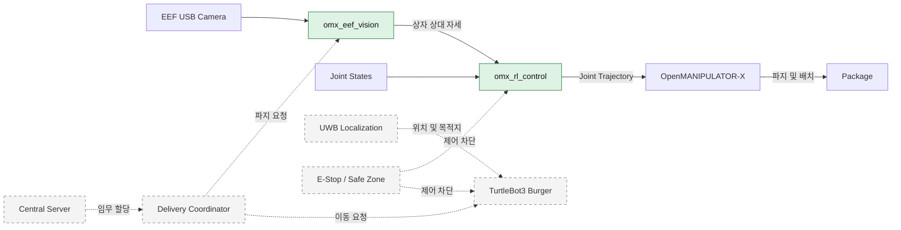
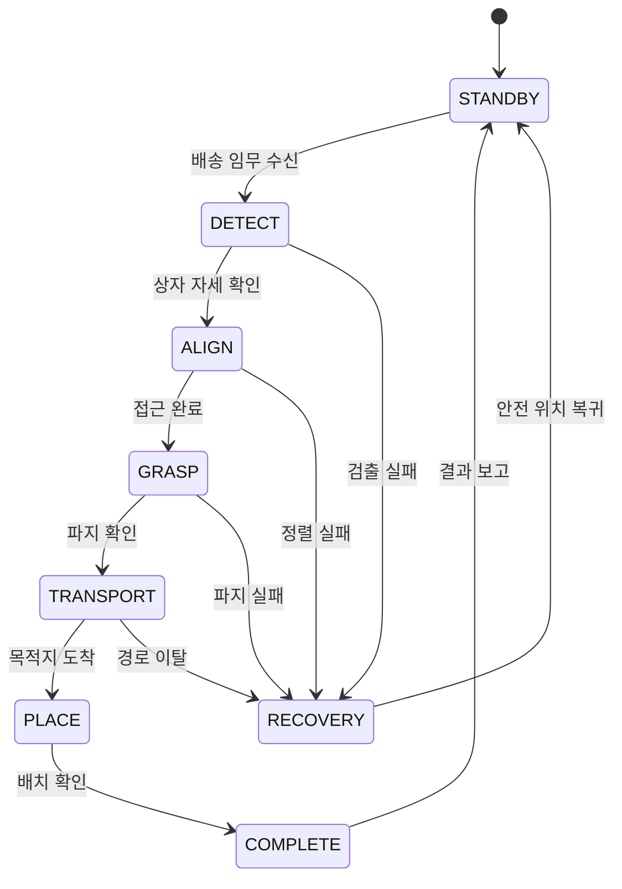

# OMX Delivery Robot

한국지능로봇경진대회 출전을 위한 **TurtleBot3 Burger + OpenMANIPULATOR-X 기반 배송로봇** ROS 2 워크스페이스다. EEF(End-Effector) 카메라로 상자의 상대 위치를 인식하고, PPO 정책으로 매니퓰레이터를 제어한 뒤 UWB 목표 지점까지 운반하는 흐름을 목표로 한다.

> **현재 단계**  
> `omx_eef_vision`, `omx_rl_control` 패키지의 기본 구조와 설계 문서를 만든 상태다. 실행 노드, launch, 파라미터, 학습 모델은 아직 구현되지 않았다.

## 시스템 구성



실선은 현재 생성된 패키지의 책임 범위, 점선은 배송 임무 통합 단계에서 연결할 구성요소를 나타낸다.

## 패키지 역할

| 패키지 | 입력 | 핵심 처리 | 출력 | 상태 |
|---|---|---|---|---|
| [`omx_eef_vision`](./omx_eef_vision/) | EEF 카메라 영상 | 상자 검출, 상대 위치·자세 추정, 신뢰도 판정 | 목표 자세 | 구조 생성 |
| [`omx_rl_control`](./omx_rl_control/) | 목표 자세, 로봇 관절 상태 | 관측값 구성, PPO 추론, 관절 명령 제한 | 관절 궤적 | 구조 생성 |

두 패키지는 **인식과 제어를 분리**한다. 카메라나 검출 모델이 바뀌어도 제어 정책의 입력 계약만 유지하면 되고, 정책을 교체해도 영상 처리 코드는 영향을 받지 않는 구조다.

## 임무 흐름



정상 흐름보다 실패 복구를 먼저 고려한다. 인식 신뢰도 부족, 관절 한계 초과, 통신 단절이 발생하면 동작을 계속하지 않고 정지 또는 `RECOVERY` 상태로 전환하는 것을 기본 원칙으로 둔다.

## 인터페이스 초안

아래 이름은 구현 전 기준안이다. 실제 노드를 작성할 때 메시지 타입과 QoS까지 함께 확정한다.

| 데이터 | ROS 2 인터페이스 | 발행 → 구독 | 용도 |
|---|---|---|---|
| 카메라 영상 | `/camera/image_raw` · `sensor_msgs/msg/Image` | Camera → Vision | 상자 검출 원본 |
| 상자 목표 자세 | `/target/object_pose` · `geometry_msgs/msg/PoseStamped` | Vision → RL Control | EEF 기준 접근 목표 |
| 관절 상태 | `/joint_states` · `sensor_msgs/msg/JointState` | Hardware → RL Control | 정책 관측값 및 한계 검사 |
| 관절 궤적 | 컨트롤러 명령 인터페이스 · `trajectory_msgs/msg/JointTrajectory` | RL Control → Controller | OpenMANIPULATOR-X 제어 |
| 비상 정지 | `/safety_stop` · `std_msgs/msg/Bool` | Safety → All Controllers | 출력 즉시 차단 |

## 개발 기준

| 단계 | 완료 조건 |
|---|---|
| 1. Vision 단독 검증 | 녹화 영상과 실시간 영상에서 상자 자세를 안정적으로 발행 |
| 2. RL 추론 검증 | 고정 입력에 대해 모델 로딩, 추론 주기, 출력 한계를 재현 가능하게 확인 |
| 3. Manipulator 연동 | 저속·무부하 조건에서 관절 명령과 E-Stop 검증 |
| 4. 파지 통합 | 인식 → 정렬 → 파지 과정을 반복 시험하고 실패 원인을 기록 |
| 5. 배송 통합 | UWB 이동, 도착, 배치, 결과 보고까지 상태 머신으로 연결 |

## 개발 환경

| 구분 | 기준 |
|---|---|
| 운영체제 | Ubuntu 22.04 |
| 미들웨어 | ROS 2 Humble |
| 이동 플랫폼 | TurtleBot3 Burger |
| 매니퓰레이터 | OpenMANIPULATOR-X + Gripper |
| 연산 장치 | Jetson Orin Nano |
| 센서 | EEF USB Camera, DWM1000 UWB |
| 정책 개발 | MuJoCo, PPO |

## 빌드

현재는 패키지 구조가 정상적으로 인식되는지 확인하는 빌드 단계다.

```bash
cd /home/ktj/omx_turtle_ws
source /opt/ros/humble/setup.bash
rosdep install --from-paths src --ignore-src -r -y
colcon build --symlink-install \
  --packages-select omx_eef_vision omx_rl_control
source install/setup.bash
```

노드의 실행 진입점과 launch 설치 설정이 추가되기 전에는 `ros2 run` 또는 `ros2 launch`로 실행할 수 없다.

## 저장소 구조

```text
omx_turtle_ws/src/
├── omx_eef_vision/       # EEF 영상 인식과 목표 자세 생성
│   ├── config/
│   ├── launch/
│   ├── models/
│   └── omx_eef_vision/
├── omx_rl_control/       # PPO 추론과 매니퓰레이터 명령 생성
│   ├── config/
│   ├── launch/
│   ├── models/
│   └── omx_rl_control/
├── turtlebot3/           # TurtleBot3 기본 패키지
└── turtlebot3_manipulation/
```

모델 가중치는 코드와 분리해 각 패키지의 `models/`에서 관리하고, 파일명·입출력 차원·학습 환경 버전은 패키지 README에 기록한다.
