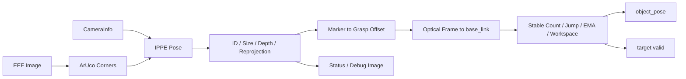
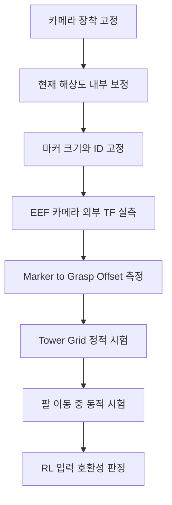

# OMX EEF ArUco 비전 계획서

| 항목 | 기준 |
|---|---|
| 작성일 | 2026-07-17 |
| 대상 패키지 | `omx_eef_vision` |
| 기준 워크스페이스 | `/home/ktj/omx_turtle_ws` |
| 상위 문서 | [최종 프로젝트 기획 및 진행 계획](<./최종 계획서.md>) |
| 연계 문서 | [OMX RL 제어 계획서](<./OMX RL 제어 계획서.md>) |

## 1. 목표와 책임

EEF USB 카메라로 배송 상자의 ArUco 마커를 검출하고, 팔 제어기가 사용할 수 있는 `base_link` 기준 6D 파지 목표 자세를 생성한다.

| 포함 | 제외 |
|---|---|
| 카메라 영상과 CameraInfo 수신 | YOLO 기반 객체 검출 |
| ArUco ID·코너 검출 | 관절 trajectory 생성 |
| IPPE 기반 마커 자세 계산 | 그리퍼 개폐 결정 |
| 마커 중심에서 상자 파지점으로 보정 | 주행 목표와 `/cmd_vel` 생성 |
| `camera_optical_frame -> base_link` TF 변환 | 배송 임무 상태 전이 |
| 자세 품질·작업영역·timeout 판정 | 마지막 자세의 무기한 재사용 |

비전 노드는 물체 자세와 유효성만 발행한다. 마커가 보인다는 사실과 팔을 움직여도 된다는 판단은 분리하며, 제어에는 `/target/valid=true`인 자세만 사용한다.

## 2. 현재 구현 상태

| 항목 | 현재 결과 | 상태 |
|---|---|---|
| ROS 2 노드 | `eef_vision_node` 구현 | 완료 |
| 검출 | OpenCV ArUco, IPPE square pose, positive-Z 해 선택 | 완료 |
| 자세 품질 | perimeter, 깊이, 재투영 오차 검사 | 완료 |
| 좌표 변환 | marker offset 적용 후 TF로 `base_link` 변환 | 완료 |
| 시간 필터 | 연속 검출, EMA, 위치·회전 jump 거부, timeout reset | 완료 |
| 진단 | visible, valid, 상태 문자열, debug image 발행 | 완료 |
| 단위 시험 | synthetic PnP, marker offset, RGB 변환 `3 passed` | 완료 |
| 실제 카메라 내부 보정 | 보정 파일은 있으나 현재 장착·해상도 기준 재검증 없음 | 검증 대기 |
| 카메라 외부 보정 | URDF 기본 TF만 있으며 실측 근거 없음 | 검증 대기 |
| 실제 마커 규격 | Dictionary, ID, 크기가 임시 설정 | 확정 대기 |
| 상자 파지점 offset | `[0, 0, 0]` | 보정 대기 |
| 정적·동적 정확도 | 실측 결과표 없음 | 검증 대기 |
| RL 입력 연동 | 토픽 계약만 존재 | 구현 대기 |

## 3. 처리 구조



### 자세 사용 규칙

| 임무 구간 | 비전 자세 처리 |
|---|---|
| 픽업 지점 접근 | 검출과 품질을 확인하지만 팔 정책은 비활성 |
| 베이스 정지 직후 | 연속 유효 프레임을 새로 확보 |
| 팔 접근 | 새로운 `/target/object_pose`를 계속 반영 |
| 파지 gate 통과 | 마지막 안정 목표를 latch |
| 그리퍼 닫기 이후 | 물체 가림을 정상으로 보고 파지 목표 갱신 중단 |
| Stay·배송 이동 | 파지 상태와 팔 자세를 사용하며 물체 마커를 필수로 요구하지 않음 |
| 배치 | 고정 배송 자세 또는 배송용 ArUco 자세를 별도 입력으로 사용 |

## 4. ROS 2 인터페이스

| 방향 | 인터페이스 | 타입 | 현재 상태 | 목적 |
|---|---|---|---|---|
| 입력 | `/eef_camera/image_raw` | `sensor_msgs/msg/Image` | 구현 | EEF 카메라 영상 |
| 입력 | `/eef_camera/camera_info` | `sensor_msgs/msg/CameraInfo` | 구현 | 카메라 내부 파라미터 |
| 입력 | TF `eef_usb_camera_optical_frame -> base_link` | TF2 | 구현 | 목표 좌표계 변환 |
| 출력 | `/target/aruco_pose` | `geometry_msgs/msg/PoseStamped` | 구현 | optical frame 기준 원시 마커 자세 |
| 출력 | `/target/object_pose` | `geometry_msgs/msg/PoseStamped` | 구현 | 필터를 통과한 `base_link` 기준 파지 목표 |
| 출력 | `/target/aruco_visible` | `std_msgs/msg/Bool` | 구현 | 지정 마커의 현재 검출 여부 |
| 출력 | `/target/valid` | `std_msgs/msg/Bool` | 구현 | 제어 입력 사용 가능 여부 |
| 출력 | `/target/aruco_status` | `std_msgs/msg/String` | 구현 | 검출·거부·timeout 원인 |
| 출력 | `/target/aruco_debug_image` | `sensor_msgs/msg/Image` | 구현 | 코너, 축, 품질 수치 확인 |

`/target/aruco_pose`는 카메라 기준 디버깅용이고, RL 런타임은 `/target/object_pose`와 `/target/valid`만 사용한다.

## 5. 현재 설정과 확정 항목

### 검출 설정

| 파라미터 | 현재값 | 적용 전 조치 |
|---|---:|---|
| `dictionary` | `DICT_APRILTAG_36h11` | 실제 인쇄 마커와 대조 |
| `marker_id` | `0` | 대회용 상자 ID 확정 |
| `accept_any_marker` | `true` | 실기기 적용 전 `false`로 변경 |
| `marker_size_m` | `0.05` | 검은 정사각형 한 변 실측 |
| `stable_detection_count` | `3` | 카메라 주기와 흔들림 로그로 조정 |
| `max_reprojection_error_px` | `8.0` | 실측 오차 분포로 조정 |
| `detection_timeout_s` | `0.35` | RL Hold 전환 시간과 함께 검증 |
| `image_timeout_s` | `1.0` | 카메라 단절 시험으로 검증 |
| position/orientation EMA | `0.35 / 0.35` | 지연과 노이즈를 함께 측정 |
| 위치·회전 jump | `0.10 m / 0.90 rad` | 실제 프레임 간 변화량으로 축소 검토 |

### 카메라와 TF 기준

| 항목 | 현재 파일 기준 | 판정 |
|---|---|---|
| CameraInfo | `320 x 240`, `eef_usb_camera.yaml` | 실제 장치·초점·해상도 재검증 필요 |
| 초점값 | `fx=337.853243`, `fy=451.458724` | 재투영 오차 시험 필요 |
| 카메라 parent | `dummy_mimic_fix` | 실제 장착 링크 확인 필요 |
| 기본 translation | `[0.02, 0.0, 0.065] m` | URDF 기본값, 실측값 아님 |
| 기본 rotation | `[0.0, 0.0, 0.0] rad` | 장착 방향 실측 필요 |
| optical rotation | `[-pi/2, 0, -pi/2]` | ROS optical frame 규칙 |
| marker-to-object offset | `[0, 0, 0]` | 상자 부착면과 파지점을 측정해 입력 |

카메라 내부 보정과 외부 TF는 서로 대체할 수 없다. CameraInfo는 영상 투영 오차를 줄이고, 외부 TF는 계산된 카메라 자세를 로봇 좌표계로 옮긴다.

## 6. 보정 계획



1. 카메라 브래킷, 초점, 해상도, pixel format을 고정한다.
2. `320 x 240` 실제 스트림으로 CameraInfo를 다시 생성한다.
3. 인쇄한 마커의 검은 정사각형 길이와 ID를 기록한다.
4. `dummy_mimic_fix` 기준 카메라 translation과 rotation을 실측한다.
5. 마커 중심에서 상자 파지점까지의 `object_offset_xyz/rpy`를 marker 축 기준으로 측정한다.
6. 타워 상면 기준점에 상자를 놓고 `base_link` 좌표와 실측값을 비교한다.
7. 결과가 안정된 뒤에만 검출·jump·EMA 파라미터를 조정한다.

## 7. 시험 데이터와 측정 지표

배송 상자의 중심 이동 가능 범위는 학습 기준으로 타워 중심에서 X/Y 각각 `±24 mm`다. 최소 시험은 중앙과 가장자리 위치, 여러 yaw를 포함한다.

| 시험 축 | 조건 |
|---|---|
| 상자 위치 | 중앙, X/Y `±24 mm`, 네 모서리 |
| 상자 yaw | `0`, `±pi/2`, `pi` |
| 카메라 거리 | 실제 정지 거리와 팔 접근 구간 전체 |
| 팔 상태 | Stay, 중간 waypoint, 최종 접근 |
| 조명 | 대회장 예상 밝기, 그림자, 반사 조건 |
| 단절 | 마커 가림, 프레임 정지, CameraInfo 누락, TF 누락 |

| 지표 | 기록 방법 | 정책 호환 기준 |
|---|---|---|
| 위치 오차 | 실측 좌표 대비 X/Y/Z mean, RMSE, p95 | 학습 Sim2Real 노이즈 `3 mm`와 비교 |
| yaw 오차 | 실측 yaw 대비 mean, p95 | 학습 범위 `0.05 rad`와 비교 |
| dropout | 유효 프레임 중 invalid 비율 | 학습 범위 `5%`와 비교 |
| 지연 | image stamp부터 object pose 발행까지 | 50 Hz 팔 제어에서 freshness 유지 여부 |
| 자세 jump | 연속 pose의 위치·회전 차이 | 필터 거부 임계값 설정 근거 |
| 재투영 오차 | 프레임별 pixel error 분포 | `max_reprojection_error_px` 설정 근거 |

실측 오차가 학습 randomization 범위를 넘으면 Vision gate만 느슨하게 하지 않는다. 먼저 CameraInfo·TF·offset을 재보정하고, 남은 오차 분포를 학습 환경에 반영해 정책을 다시 평가하거나 재학습한다.

## 8. 구현·검증 단계

| 단계 | 작업 | 완료 기준 | 상태 |
|---|---|---|---|
| E0 | 코드·토픽·파라미터 기준 확인 | 현재 구현과 본 문서가 일치 | 완료 |
| E1 | 단위 시험 실행 | synthetic PnP, offset, 영상 변환 `3 passed` | 완료 |
| E2 | 카메라 입력 고정 | 장치, 해상도, CameraInfo, frame ID 기록 | 대기 |
| E3 | 마커·외부 TF·파지점 보정 | 실측값을 YAML·URDF에 반영 | 대기 |
| E4 | 정적 정확도 시험 | 위치·yaw·dropout·재투영 오차 표 작성 | 대기 |
| E5 | 동적·가림 시험 | 팔 이동과 가림에서 timeout·filter 전이 확인 | 대기 |
| E6 | RL replay 연결 | 저장된 pose로 33D 관측과 Hold 전이 검증 | 대기 |
| E7 | 실기기 파지 연결 | 접근 중 보정, latch, 가림 후 파지 흐름 확인 | 대기 |
| E8 | 전체 배송 통합 | 픽업과 배송 상태에서 올바른 목표만 제공 | 대기 |

## 9. 안전 조건

| 조건 | 비전 출력 | 제어기 요구 동작 |
|---|---|---|
| 영상 timeout | `visible=false`, `valid=false` | 새 팔 명령 중단 |
| CameraInfo 무효 | `valid=false` | 보정 전 동작 금지 |
| 지정 ID 불일치 | `valid=false` | 다른 물체 무시 |
| 재투영 오차 초과 | 해당 pose 폐기 | 이전 pose로 계속 접근하지 않음 |
| TF 실패 | `valid=false` | `base_link` 목표 생성 금지 |
| workspace 이탈 | 해당 pose 폐기 | Hold 또는 Recovery |
| 위치·회전 jump | 해당 표본 폐기 | 안정 pose 재확보 대기 |
| 파지 gate 이후 가림 | latch된 목표 유지 | 닫기·lift 단계만 수행 |

## 10. 결과 기록

검증이 시작되면 본 계획서의 상태를 갱신하고 측정 결과는 별도 표로 누적한다.

```text
docs/
├── OMX EEF 비전 계획서.md
├── OMX EEF 비전 검증 결과.md        # 생성 예정
└── logs/
    └── vision/                       # rosbag·CSV 경로만 문서에 기록
```

검증 결과에는 카메라 장치명, 해상도, CameraInfo checksum, 마커 이미지·실측 크기, TF 값, 시험 위치, 조명 조건, 코드 revision을 함께 남긴다.

## 11. 즉시 진행할 작업

1. 실제 사용할 마커의 Dictionary, ID, 크기를 확정한다.
2. `accept_any_marker=false` 기준으로 설정을 고정한다.
3. 장착된 카메라의 `320 x 240` CameraInfo를 재검증한다.
4. EEF 카메라 TF와 marker-to-grasp offset을 실측한다.
5. 중앙·가장자리·yaw 조건의 rosbag을 수집한다.
6. 위치·yaw·dropout 오차를 계산해 PPO randomization 범위와 비교한다.
7. 검증된 YAML과 TF를 `omx_turtle.launch.py` 통합 설정으로 고정한다.

## 12. 완료 정의

- 지정 ArUco 하나만 선택하고 다른 마커는 제어 입력에서 제외한다.
- 실제 CameraInfo, 카메라 TF, marker-to-grasp offset에 실측 근거가 있다.
- 타워 전체 시험 위치에서 pose 오차와 dropout 통계가 기록되어 있다.
- 영상·검출·TF timeout 시 `/target/valid=false`가 확인된다.
- 팔 접근 중에는 pose가 갱신되고 파지 직전에는 안정 목표가 latch된다.
- 측정된 Vision 오차가 학습 범위 안에 있거나, 초과 오차를 반영한 재평가 결과가 있다.
- 최종 설정으로 실제 상자 파지 시험을 통과한 기록이 있다.
