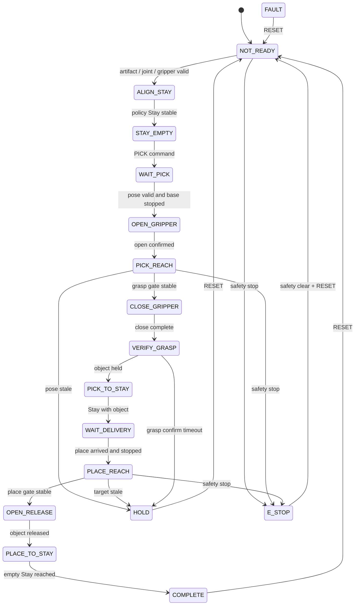

# OMX 팔 강화학습 런타임 계획서

| 항목 | 기준 |
|---|---|
| 작성일 | 2026-07-17 |
| 대상 패키지 | `omx_rl_control` |
| 런타임 워크스페이스 | `/home/ktj/omx_turtle_ws` |
| 학습 워크스페이스 | `/home/ktj/omx_train_ws` |
| 상위 문서 | [최종 프로젝트 기획 및 진행 계획](<./최종 계획서.md>) |
| 선행 문서 | [OMX EEF 비전 계획서](<./OMX EEF 비전 계획서.md>) |

## 1. 목표와 제어 범위

학습된 PPO 정책을 ROS 2 런타임에 배포해 OpenMANIPULATOR-X의 `joint1`~`joint4`를 제어한다. 베이스 이동과 그리퍼 개폐는 PPO action에 포함하지 않고 결정론적 상태 머신으로 제어한다.

| 영역 | 담당 | PPO 학습 여부 |
|---|---|---|
| ArUco 검출·자세 추정 | `omx_eef_vision` | 학습 외부 |
| 픽업·배송 위치 이동 | `turtlebot3_position` | 학습하지 않음 |
| 팔 접근·보정·Stay 복귀 | `omx_rl_control` | PPO + reference controller |
| 그리퍼 Open·Close·Hold·Release | `omx_rl_control` 상태 머신 | 학습하지 않음 |
| 임무 순서와 재시도 | `omx_turtle_node` | 학습하지 않음 |
| 관절·속도·가속도·timeout 제한 | `omx_rl_control` safety layer | 학습하지 않음 |

PPO는 단독 관절 목표 생성기가 아니다. 학습과 동일한 기준 경로를 만들고, 그 위에 PPO residual을 더한 뒤 필터·관절 제한을 적용해야 한다.

## 2. 현재 진행 상태

| 항목 | 현재 결과 | 상태 |
|---|---|---|
| PPO 학습 | pick, place, Stay, base-stop, Sim2Real curriculum 완료 | 완료(시뮬레이션) |
| 최종 정책 | `arm_grasp_latest.zip` 존재 | 완료 |
| 평가 | 단계별 100 episode YAML 존재 | 완료(시뮬레이션) |
| 런타임 상세 초안 | `omx_rl_control/docs/arm_delivery_runtime_plan.md` 존재 | 작성 완료 |
| ROS 2 실행 노드 | 50 Hz PPO 추론·상태 머신·안전 gate 구현 | 완료 |
| launch·YAML | 단독 실행 및 선택적 fake/real bringup 구현 | 완료 |
| console entry point | `rl_control_node` 설치·실행 확인 | 완료 |
| 정책 배포 | PPO·metadata·config·평가·manifest 버전 고정 | 완료 |
| 33D observation parity | MuJoCo golden vector 33개 원소 완전 일치 | 완료 |
| reference controller parity | FK·waypoint·IK·reference·1-step target 일치 | 완료 |
| fake hardware | 전체 Pick-Place, E-Stop, Vision timeout 통과 | 완료 |
| Gazebo 물리 시험 | 접촉 파지, Stay 운반, 타워 배치, 최종 Stay까지 `COMPLETE` | 완료(고정 위치 1회) |
| 자동 시험 | `19 passed, 1 skipped` | 완료 |
| 실기기 | 저속 파지·배치 시험 없음 | 미진행 |

## 3. 최종 정책 artifact

| 항목 | 값 |
|---|---|
| 정책 버전 | `arm_delivery_residual_v2` |
| 정책 파일 | `/home/ktj/omx_train_ws/policies/latest/arm_delivery_residual_v2/arm_grasp_latest.zip` |
| 정책 크기 | `1,842,083 bytes` |
| 정책 SHA-256 | `d838bab2c6b034252cdf10e52d52a9a77de3bc80f7c9c41ea82554f1b8aa50f2` |
| metadata SHA-256 | `06a4db14fb2c1502617608269a8dcdc326e5755787ce4171a6bd54a56ceb24a1` |
| training config SHA-256 | `4b3b81c94fb288970332c4058d762885be7ece1acf53122c5be0e3911dd96565` |
| metadata `model_sha256` | `2443c015eae20d4b8a5a09ce8e8bd48c0a355f4f7e1aebc7f663b6bc4fd5a9ad`, MuJoCo `scene.xml` checksum |
| 누적 step | `537,088` |
| 알고리즘 | Stable-Baselines3 PPO `MlpPolicy` |

현재 metadata의 `model_sha256`은 PPO ZIP이 아니라 학습 MuJoCo 모델의 checksum이다. 배포본은 `runtime_manifest.yaml`에서 정책·metadata·학습 config·평가 파일 checksum을 분리해 검증한다.

### 배포 디렉터리

```text
omx_rl_control/models/policies/arm_delivery_residual_v2/
├── policy.zip
├── policy_metadata.yaml
├── training_config.yaml
├── runtime_manifest.yaml
├── evaluation/
│   ├── full_tower_100.yaml
│   ├── place_full_tower_100.yaml
│   ├── pick_place_mixed_100.yaml
│   └── sim2real_robust_100.yaml
└── SHA256SUMS
```

런타임은 `/home/ktj/omx_train_ws`를 직접 참조하지 않는다. 위 디렉터리의 버전 고정 artifact만 사용하고 시작 시 checksum을 검증한다.

## 4. 학습·런타임 정책 계약

| 항목 | 계약 |
|---|---|
| 관측 | `33D`, `float32`, 각 원소 `[-1, 1]` clip |
| 행동 | `4D`, `[joint1, joint2, joint3, joint4]`, `[-1, 1]` |
| 제어 주기 | `0.02 s`, 50 Hz |
| 제어 모드 | `reference + 0.1 * PPO residual` |
| action filter | `filtered += 0.18 * (control - filtered)` |
| action scale | 관절별 `0.014 rad` |
| Stay | `[0.0, 0.0, 1.38, -1.38] rad` |
| workspace | min `[0.10, -0.18, 0.08]`, max `[0.42, 0.18, 0.52] m` |
| 그리퍼 | open `0.019 m`, close `-0.010 m` |

### 33차원 관측 순서

| index | 값 | 학습 코드와 동일한 정규화 |
|---|---|---|
| `0:4` | arm qpos | `2 * (q-low)/(high-low) - 1` |
| `4:8` | arm qvel | `[2, 2, 2, 2] rad/s`로 나눔 |
| `8` | gripper position | close `-0.010`, open `0.019`를 `[-1,1]`로 변환 |
| `9` | gripper velocity | `0.25 m/s`로 나눔 |
| `10:13` | EEF position | workspace min/max를 `[-1,1]`로 변환 |
| `13:16` | active target position | workspace min/max를 `[-1,1]`로 변환 |
| `16:19` | target minus EEF | `2 * relative / workspace_span` |
| `19:21` | target bearing | `[sin, cos]` |
| `21:23` | target yaw | `[sin, cos]` |
| `23` | gripper roll error | `wrap(sum(q2:q4)) / pi` |
| `24` | object grasped | `0` 또는 `1` |
| `25:29` | phase one-hot | PICK_REACH, PICK_TO_STAY, PLACE_REACH, PLACE_TO_STAY |
| `29:33` | previous raw PPO action | 이전 4D raw action, filtered action 아님 |

최종 observation은 전체를 `[-1,1]`로 clip하고 `float32`로 변환한다. 순서, 정규화, phase 번호가 하나라도 바뀌면 같은 정책으로 간주하지 않는다.

### 행동 처리

```text
raw_action = policy.predict(observation, deterministic=True)
control_action = clip(reference_action + 0.1 * raw_action, -1, 1)
filtered_action += 0.18 * (control_action - filtered_action)
arm_target = clip(arm_target + filtered_action * 0.014, joint_low, joint_high)
```

| 관절 | 학습 MJCF 기준 제한 |
|---|---:|
| `joint1` | `[-2.82743, 2.82743] rad` |
| `joint2` | `[-1.79071, 1.57080] rad` |
| `joint3` | `[-0.942478, 1.38230] rad` |
| `joint4` | `[-1.79071, 2.04204] rad` |

ROS 런타임에서는 이 범위와 실제 URDF·ros2_control 범위의 교집합을 사용한다. 추가로 관절 속도·가속도 제한을 적용한 짧은 `JointTrajectory`로 변환한다.

## 5. Reference controller 재현

학습 환경은 다음 순서로 기준 action을 만든다.

1. 충돌 회피용 접근 관절 waypoint를 순서대로 따른다.
2. waypoint를 통과하면 현재 Vision 목표로 pregrasp 기준 관절을 계산한다.
3. Pick/Place 접근에서는 pregrasp 관절 목표를 따른다.
4. 파지·해제 gate가 누적되는 동안 reference action을 0으로 둔다.
5. 복귀 phase에서는 Stay 관절 목표를 따른다.
6. PPO 출력의 10%를 기준 action에 residual로 더한다.

| 학습 기준값 | 값 |
|---|---|
| approach waypoint 1 | `[0.0, -0.5, 0.5, 0.0]` |
| approach waypoint 2 | `[0.0, 0.5, 0.2, -0.7]` |
| waypoint tolerance | `0.08 rad` |
| pregrasp height offset | `0.025 m` |
| reference action limit | stage 설정에 따라 최대 `1.0` |

PPO ZIP만 ROS에 연결하면 학습과 다른 제어기가 된다. reference waypoint, pregrasp IK, phase, target latch를 학습 코드와 같은 입력·출력으로 재현한 뒤 parity 시험을 통과해야 한다.

## 6. 런타임 상태 머신



| 상태 | 정책 phase | 그리퍼 | 베이스 |
|---|---|---|---|
| `ALIGN_STAY` | 비활성, deterministic reference | 현재 상태 | 강제 Hold |
| `STAY_EMPTY` | 비활성 | Open 또는 안전 상태 | 주행 허용 |
| `PICK_REACH` | `PICK_REACH` | 최대 Open | 강제 Hold |
| `CLOSE_GRIPPER` | action 고정 | Close | 강제 Hold |
| `PICK_TO_STAY` | `PICK_TO_STAY` | Hold Close | 강제 Hold |
| `WAIT_DELIVERY` | Stay 유지 | Hold Close | 주행 허용 |
| `PLACE_REACH` | `PLACE_REACH` | Hold Close | 강제 Hold |
| `OPEN_RELEASE` | action 고정 | Open | 강제 Hold |
| `PLACE_TO_STAY` | `PLACE_TO_STAY` | Open | 강제 Hold |
| `HOLD/FAULT/E_STOP` | 새 action 차단 | 현재 또는 안전 명령 | 정지 |

## 7. ROS 2 인터페이스 계획

| 방향 | 인터페이스 | 타입 | 목적 |
|---|---|---|---|
| 입력 | `/target/object_pose` | `geometry_msgs/msg/PoseStamped` | `base_link` 기준 픽업 목표 |
| 입력 | `/target/valid` | `std_msgs/msg/Bool` | Vision pose freshness |
| 입력 | `/target/delivery_pose` | `geometry_msgs/msg/PoseStamped` | 배송 배치 목표 |
| 입력 | `/joint_states` | `sensor_msgs/msg/JointState` | 관절·그리퍼 관측 |
| 입력 | `/odom` | `nav_msgs/msg/Odometry` | 베이스 정지 확인 |
| 입력 | `/turtlebot3_control/base_arrived` | `std_msgs/msg/Bool` | 픽업·배송 도착 gate |
| 입력 | `/safety_stop` | `std_msgs/msg/Bool` | 즉시 출력 차단 |
| 입력 | `/rl_control/command` | `std_msgs/msg/String` | `PICK`, `PLACE`, `HOLD`, `RESET`, `E_STOP` |
| 출력 | `/arm_controller/joint_trajectory` | `trajectory_msgs/msg/JointTrajectory` | 제한된 팔 관절 목표 |
| Action client | `/gripper_controller/gripper_cmd` | `control_msgs/action/GripperCommand` | Open·Close·Hold·Release |
| 출력 | `/target/base_hold` | `std_msgs/msg/Bool` | 팔 동작 중 먹스 정지 |
| 출력 | `/rl_control/status` | `std_msgs/msg/String` | 상태, 상세 원인, 모델 버전, 파지 상태 |

현재 통합 전 단계에서는 문자열 명령과 상태 토픽을 사용한다. 전체 배송 통합 시 취소·feedback·결과 계약이 필요한지 검토한 뒤 전용 ROS 2 Action으로 승격한다.

## 8. 구현 모듈

```text
omx_rl_control/
├── config/rl_control.yaml
├── launch/rl_control.launch.py
├── models/policies/arm_delivery_residual_v2/
└── omx_rl_control/
    ├── rl_control_node.py
    ├── model_contract.py
    ├── observation_builder.py
    ├── reference_controller.py
    ├── action_limiter.py
    ├── gripper_manager.py
    └── state_machine.py
```

| 모듈 | 책임 |
|---|---|
| `model_contract.py` | 파일 존재, checksum, SB3, 차원, joint 순서 검증 |
| `observation_builder.py` | ROS 상태를 학습과 동일한 33D로 변환 |
| `reference_controller.py` | waypoint, pregrasp IK, Stay 기준 action 생성 |
| `action_limiter.py` | residual 결합, filter, 관절·속도·가속도 제한 |
| `gripper_manager.py` | action goal, timeout, 파지·해제 확인 |
| `state_machine.py` | Pick, Stay, Place, Hold, Fault, E-Stop 전이 |
| `rl_control_node.py` | ROS 입출력, 50 Hz timer, 전체 모듈 조정 |

## 9. 구현 단계와 완료 기준

| 단계 | 작업 | 완료 기준 | 상태 |
|---|---|---|---|
| R0 | 정책 배포 manifest 작성 | 정책·MJCF·config checksum 의미가 분리됨 | 완료 |
| R1 | 학습 golden vector export | observation, raw action, reference, final target 표본 확보 | 완료 |
| R2 | model contract·observation builder | 33D 순서·정규화가 golden vector와 일치 | 완료 |
| R3 | reference·action limiter | 기준 action과 최종 관절 target이 학습 코드와 일치 | 완료 |
| R4 | state machine·gripper | Open, Close, Hold, Release, Stay 전이 통과 | 완료(fake) |
| R5 | fake ros2_control | Pick·Place 전체 전이와 timeout·E-Stop 통과 | 완료 |
| R6 | Vision replay | 자세 갱신, dropout, latch, Hold 전이 통과 | 대기 |
| R7 | 저속 실기기 Pick | 접근, 파지, lift, Stay 복귀 반복 결과 기록 | 대기 |
| R8 | 저속 실기기 Place | 배송 전개, release, Stay 복귀 반복 결과 기록 | 대기 |
| R9 | 전체 배송 통합 | UWB 이동을 사이에 둔 전체 상태 전이 완료 | 대기 |
| R10 | 대회 안정화 | 반복 성공률, 충돌, 낙하, 복구 결과 기준 통과 | 대기 |

## 10. 시험 계획

### Offline parity

| 시험 | 확인 내용 |
|---|---|
| artifact 검사 | 파일 누락·checksum 변경 시 시작 거부 |
| observation golden test | 33개 원소와 dtype, clip 결과 비교 |
| deterministic inference | 같은 observation에서 같은 raw action 재현 |
| reference parity | waypoint·IK·Stay phase별 reference action 비교 |
| action parity | residual, EMA filter, scale 적용 후 joint target 비교 |
| joint order | `/joint_states` 순서가 달라도 이름으로 재배열 |

### Fake hardware

| 시험 | 통과 조건 |
|---|---|
| 정상 Pick | pose valid와 base Hold 이후에만 trajectory 발행 |
| 자세 timeout | 한 제어 주기 안에 새 목표 진행 중단 |
| 베이스 움직임 | 즉시 action 0과 Hold 전환 |
| NaN·Inf·차원 오류 | trajectory 발행 없이 FAULT |
| 관절 한계 | 교집합 범위 밖 명령 0건 |
| E-Stop | trajectory·gripper 신규 goal 즉시 차단, 자동 복귀 금지 |
| 제어기 중복 | legacy `mp_control`과 동시 활성화 불가 |

2026-07-17 검증에서는 학습 Stay 정렬 후 Pick·grasp·Stay·Place·release·빈 팔 Stay가 `COMPLETE`까지 이어졌다. `PICK_REACH` 중 `/safety_stop=true`는 `E_STOP`과 `base_hold=true`를 유지했고, Vision pose 중단과 odometry 이동 주입은 각각 명시적 원인의 `HOLD`로 전환됐다.

### Gazebo 물리 시험

| 항목 | 검증값 |
|---|---|
| 타워 | `0.13 x 0.13 x 0.17 m`, 중심 X `0.27 m` |
| 상자 | `0.06 x 0.055 x 0.055 m`, 질량 `0.05 kg` |
| 물리 파지 명령 | `0.0045 m`, 5.5 cm 폭과 4 mm 압축 기준 |
| 릴리스 안정화 | `0.75 s`, Gazebo 전용 |
| trajectory 시간 | `0.25 s`, Gazebo 전용 |
| 최종 상자 중심 | `(0.271851, 0.000003, 0.197500) m` |
| 결과 | 타워 상판 배치 후 빈 팔 Stay, `COMPLETE` |

첫 실행에서 상태만 `COMPLETE`이고 상자가 바닥에 떨어지는 오류를 확인했다.
릴리스 안정화, 파지 폭, EEF-상자 중심 X 오프셋을 보정한 뒤 물리 좌표로
타워 배치를 재검증했다. 상세 원인과 변경 파일은
[변경 이력](<./변경 이력.md>)에 기록한다.

### 실기기

1. 무부하 Stay와 관절 limit 시험
2. PPO 없이 그리퍼 Open·Close·Hold·Release 시험
3. 중앙 상자 Pick 10회
4. 타워 가장자리·yaw 변화 Pick 시험
5. 물체를 잡은 Stay와 짧은 베이스 이동 시험
6. 중앙 Place와 빈 팔 Stay 시험
7. 비정형 Pick·Place 전체 반복 시험

시뮬레이션 결과와 실기기 결과를 같은 성공률로 취급하지 않는다. 실기기 시험은 충돌, 낙하, timeout, 수동 개입 횟수를 별도 기록한다.

## 11. 현재 모델의 성능과 위험

| 평가 | 성공률 | 충돌률 |
|---|---:|---:|
| 전체 타워 Pick | 97% | 3% |
| 전체 타워 Place | 99% | 1% |
| Pick/Place 혼합 | 98% | 2% |
| 전체 Sim2Real | 92% | 7% |

Sim2Real 평가의 양의 X 위치 버킷은 성공률 `80.0~83.3%`, 충돌률 `16.7~20.0%`로 다른 영역보다 낮다. 실기기 초기 시험에서는 해당 영역을 금지하거나 workspace margin을 두고, 충돌 없는 중앙 영역부터 검증한다.

| 위험 | 대응 |
|---|---|
| reference controller 불일치 | golden vector parity를 실기기 전 필수 gate로 설정 |
| ROS·MuJoCo 관절 순서 차이 | 이름 기반 재정렬과 시작 시 joint set 검증 |
| EEF 위치 계산 차이 | 동일 `base_link`와 URDF FK 사용, 학습 workspace와 비교 |
| Vision 오차가 학습 범위 초과 | 재보정 후 실제 분포를 학습 randomization에 반영 |
| Jetson 추론 지연 | 50 Hz 지연·jitter 측정, deadline 초과 시 Hold |
| gripper 부하 정보 부재 | close 완료만으로 성공 처리하지 않고 lift·물체 추종 확인 |
| legacy 제어기 충돌 | launch 조건을 상호 배타적으로 구성 |
| 양의 X 끝단 충돌 | 초기 workspace 축소, 집중 재학습, collision margin 적용 |

## 12. 다음 작업

1. EEF Vision rosbag으로 위치 보정·dropout·target freshness를 반복 검증한다.
2. legacy `mp_control`과 RL 팔 제어기가 동시에 시작되지 않도록 최종 런치 gate를 연결한다.
3. 실기기에서 무부하 `ALIGN_STAY`와 그리퍼 Open·Close를 저속 검증한다.
4. 중앙 상자 Pick부터 10회 반복하고 충돌·낙하·수동 개입을 기록한다.
5. 실제 파지 확인 신호를 `/rl_control/grasp_confirmed`에 연결한다.
6. 중앙 Place 시험 후 UWB 이동을 사이에 둔 전체 배송 런치로 통합한다.

## 13. 완료 정의

- 배포 정책과 설정의 checksum을 시작 시 검증한다.
- 학습 코드와 ROS 런타임의 33D observation 및 final joint target이 golden vector에서 일치한다.
- `reference + residual` 제어와 4개 phase가 동일하게 재현된다.
- 베이스 정지와 Vision valid가 모두 충족될 때만 Pick·Place action이 시작된다.
- 파지 후 그리퍼를 유지한 채 Stay로 복귀하고 배송 이동을 견딘다.
- 배송 위치에서 배치·해제 후 빈 팔 Stay까지 완료한다.
- 카메라·TF·joint state·추론 timeout과 E-Stop에서 안전 정지한다.
- legacy 팔 제어기와 RL 팔 제어기가 동시에 명령하지 않는다.
- fake hardware, 중앙 실기기, 비정형 실기기 결과가 각각 문서화되어 있다.
