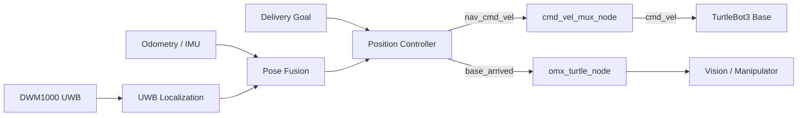
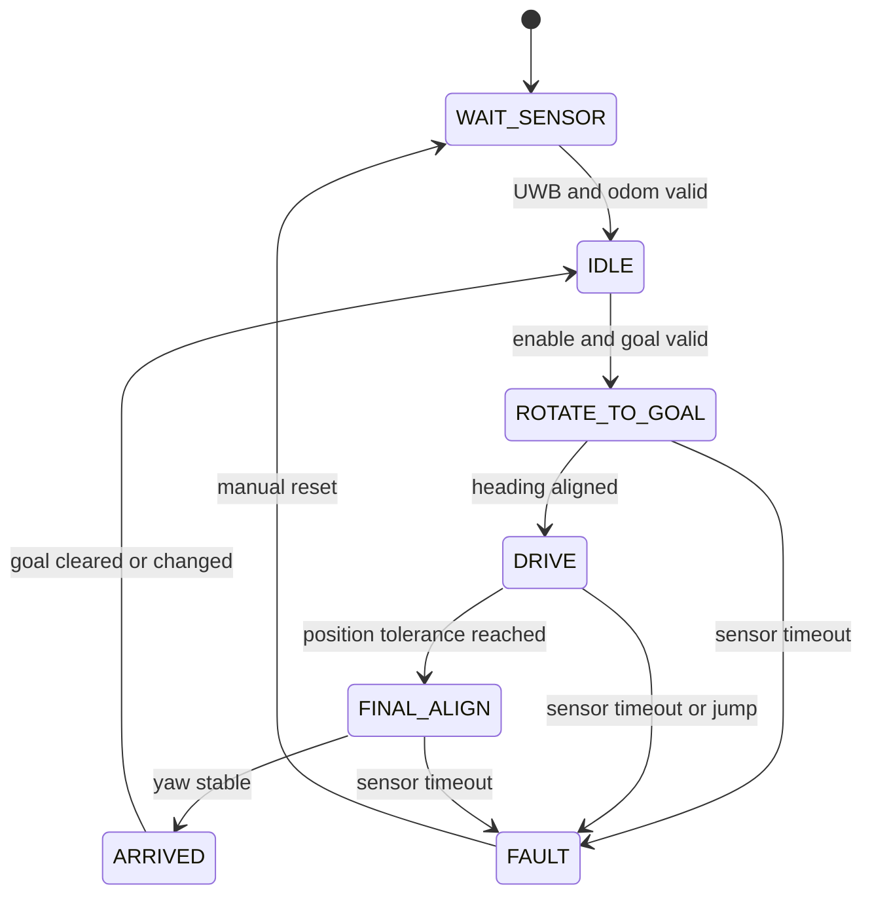
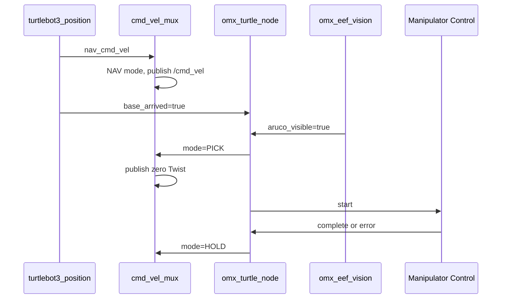

# TurtleBot3 UWB 위치 제어 계획 진행서

작성일: 2026-07-17

상위 기준 문서: [지능로봇경진대회 배송로봇 최종 기획 및 진행 계획](<./최종 계획서.md>)

## 1. 목표

- `turtlebot3_position` 패키지에 DWM1000 UWB 기반 위치 추정과 목표점 이동 제어를 구현한다.
- 기존 라인팔로워에는 의존하지 않는다.
- 위치 제어기는 실제 `/cmd_vel`을 직접 발행하지 않는다.
- 이동 명령과 도착 신호를 `turtlebot3_control`에 전달한다.
- 최종 통합 진입점은 `turtlebot3_control/launch/omx_turtle.launch.py`로 유지한다.



## 2. 현재 진행 상태

| 구분 | 상태 | 현재 결과 |
|---|---|---|
| 최종 통합 launch | 완료 | `omx_turtle.launch.py`로 통일 |
| 라인팔로워 제거 | 완료 | launch·토픽·패키지 의존성 0건 |
| 베이스 명령 중재 | 부분 완료 | `cmd_vel_mux_node` 구현, 전체 통합 시험 대기 |
| 이동 명령 입력 | 계약 완료 | `/turtlebot3_control/nav_cmd_vel` |
| 도착 신호 입력 | 계약 완료 | `/turtlebot3_control/base_arrived` |
| 파지 시작 gate | 부분 완료 | 도착 신호와 ArUco 검출 확인 로직 구현, 전체 임무 시험 대기 |
| `turtlebot3_position` 디렉터리 | 생성 | 현재 빈 디렉터리만 존재하며 ROS 패키지 구조 없음 |
| UWB 장치 입력 | 미구현 | DWM1000 연결 방식과 메시지 형식 확인 필요 |
| UWB 위치 계산 | 미구현 | anchor 배치·좌표계·필터 필요 |
| 목표점 제어 | 미구현 | 거리·방향 제어기와 상태 머신 필요 |
| 통합·실기기 평가 | 미진행 | 단계별 안전 시험 필요 |

## 3. 패키지 책임

| 포함 | 제외 |
|---|---|
| DWM1000 데이터 수신 | ArUco 물체 검출 |
| UWB 위치 계산·필터링 | 매니퓰레이터 PPO 추론 |
| UWB 좌표계 보정 | `/cmd_vel` 최종 중재 |
| 목표 위치까지의 베이스 제어 | 그리퍼 상태 머신 |
| 도착·오류·센서 상태 발행 | 배송 임무 스케줄링 |

`turtlebot3_position`은 위치와 이동만 담당한다. 팔 동작 중 베이스 정지는 `turtlebot3_control` 먹스가 담당한다.

## 4. 인터페이스 계약

### 입력

| 토픽·입력 | 타입 | 용도 | 상태 |
|---|---|---|---|
| DWM1000 장치 입력 | 확인 필요 | anchor 거리 또는 계산된 UWB 좌표 | 미확정 |
| `/odom` | `nav_msgs/msg/Odometry` | yaw·속도·단기 움직임 보완 | 예정 |
| `/turtlebot3_position/goal` | `geometry_msgs/msg/PoseStamped` | 배송 목표 좌표와 최종 방향 | 예정 |
| `/turtlebot3_position/enable` | `std_msgs/msg/Bool` | 이동 제어 활성화 | 예정 |
| `/safety_stop` | `std_msgs/msg/Bool` | 비상 정지 | 예정 |

### 출력

| 토픽 | 타입 | 용도 | 소비 노드 |
|---|---|---|---|
| `/turtlebot3_position/pose` | `geometry_msgs/msg/PoseWithCovarianceStamped` | 필터링된 로봇 전역 자세 | 진단·제어 |
| `/turtlebot3_position/status` | `std_msgs/msg/String` | 상태·센서 freshness·오차 | 운영자 |
| `/turtlebot3_control/nav_cmd_vel` | `geometry_msgs/msg/Twist` | 먹스에 전달할 이동 명령 | `cmd_vel_mux_node` |
| `/turtlebot3_control/base_arrived` | `std_msgs/msg/Bool` | 목표 도착 및 안정화 완료 | `omx_turtle_node` |

### 핵심 규칙

- `turtlebot3_position`은 `/cmd_vel`을 직접 발행하지 않는다.
- `base_arrived=true`는 한 번만 발행하지 않고 도착 상태 동안 주기적으로 발행한다.
- 현재 `omx_turtle_node`의 freshness 제한은 `2.0 s`이므로 도착 신호는 최소 `5 Hz` 이상 유지한다.
- UWB 또는 odometry가 timeout되면 속도 0과 `base_arrived=false`를 즉시 발행한다.
- 목표가 바뀌면 이전 도착 상태를 즉시 해제한다.

## 5. 좌표계 계획

| 좌표계 | 의미 |
|---|---|
| `uwb_map` | anchor 위치를 고정한 UWB 전역 좌표계 |
| `odom` | TurtleBot3의 연속적인 로컬 이동 좌표계 |
| `base_link` | 로봇 중심 좌표계 |

- 모든 anchor 좌표는 meter 단위로 관리한다.
- UWB 원점과 경기장 기준점의 위치·축 방향을 실측해 설정 파일에 기록한다.
- 단일 UWB tag의 위치만으로는 로봇 yaw를 안정적으로 얻기 어렵다.
- 초기 구현은 UWB의 `x, y`와 `/odom` 또는 IMU의 yaw를 결합한다.
- UWB와 odometry 사이의 초기 위치·방향 offset을 시작 시점에 보정한다.
- 위치 jump, anchor 부족, GDOP 악화 시 해당 UWB 표본을 거부한다.

## 6. 노드 구성안

| 노드 | 책임 |
|---|---|
| `uwb_driver_node` | DWM1000 직렬·USB·네트워크 데이터 수신, 단위 변환, 장치 상태 발행 |
| `uwb_localization_node` | anchor range 기반 다변측량 또는 장치 좌표 검증, 필터링, covariance 계산 |
| `position_controller_node` | 목표 거리·방향 계산, 속도 명령, 도착 판정, 안전 timeout |

장치가 이미 `x, y` 좌표를 계산해 제공하면 `uwb_driver_node`와 `uwb_localization_node`를 하나로 단순화할 수 있다. 장치 프로토콜을 확인하기 전에는 임의의 serial parser를 작성하지 않는다.

## 7. 이동 상태 머신



| 상태 | `nav_cmd_vel` | `base_arrived` |
|---|---|---|
| `WAIT_SENSOR` | 0 | false |
| `IDLE` | 0 | false |
| `ROTATE_TO_GOAL` | 각속도만 제한 출력 | false |
| `DRIVE` | 선속도·각속도 제한 출력 | false |
| `FINAL_ALIGN` | 저속 각도 보정 | false |
| `ARRIVED` | 0 | true |
| `FAULT` | 0 | false |

## 8. 제어 계획

```text
distance_error = norm(goal_xy - robot_xy)
target_heading = atan2(goal_y - robot_y, goal_x - robot_x)
heading_error = wrap(target_heading - robot_yaw)

linear_x  = clamp(kp_distance * distance_error, 0, max_linear_speed)
angular_z = clamp(kp_heading * heading_error
                  + kd_heading * heading_error_rate,
                  -max_angular_speed,
                  max_angular_speed)
```

- 큰 방향 오차에서는 제자리 회전 후 전진한다.
- 목표점에 가까워질수록 선속도를 단계적으로 낮춘다.
- 최종 방향이 필요하면 위치 도착 후 `FINAL_ALIGN`에서 별도로 맞춘다.
- UWB 잡음으로 도착 상태가 반복 전환되지 않도록 hysteresis와 연속 안정 횟수를 둔다.
- 최초 속도 제한은 낮게 시작하고 실측 로그를 기반으로 높인다.

초기 파라미터는 설정 파일에 노출하되 실측 전 임의로 확정하지 않는다.

| 파라미터 | 의미 |
|---|---|
| `max_linear_speed_mps` | 최대 선속도 |
| `max_angular_speed_radps` | 최대 각속도 |
| `position_tolerance_m` | 목표 위치 허용오차 |
| `yaw_tolerance_rad` | 최종 방향 허용오차 |
| `arrival_stable_count` | 연속 도착 판정 횟수 |
| `uwb_timeout_s` | UWB 데이터 timeout |
| `odom_timeout_s` | yaw·속도 데이터 timeout |
| `max_position_jump_m` | UWB 위치 jump 거부 기준 |

## 9. 안전 조건

| 조건 | 동작 |
|---|---|
| UWB timeout | 속도 0, 도착 false, `WAIT_SENSOR` 또는 `FAULT` |
| odometry timeout | 속도 0, 도착 false |
| anchor 수 부족 | 위치 갱신 거부 |
| 위치 jump | 표본 거부 및 연속 발생 시 `FAULT` |
| NaN·Inf | 명령 폐기, 속도 0 |
| 목표 없음 | `IDLE`, 속도 0 |
| `enable=false` | 즉시 속도 0 |
| `safety_stop=true` | 즉시 `FAULT`, 자동 재시작 금지 |
| 팔 동작 시작 | 먹스 `PICK/HOLD`, 베이스 출력 0 |

## 10. `omx_turtle.launch.py` 통합 계획

1. `turtlebot3_position`을 `ament_python` 패키지로 생성한다.
2. `position.launch.py`와 UWB·제어 설정 파일을 설치한다.
3. `turtlebot3_control/package.xml`에 `turtlebot3_position` 실행 의존성을 추가한다.
4. `omx_turtle.launch.py`에 `start_position` 인자와 position launch include를 추가한다.
5. position 출력 토픽을 기존 먹스·coordinator 입력과 연결한다.
6. 라인팔로워나 `host_mission_interfaces` 의존성을 다시 추가하지 않는다.



## 11. 목표 디렉터리 구조

```text
turtlebot3_position/
├── config/
│   ├── uwb.yaml
│   └── position_controller.yaml
├── launch/
│   └── position.launch.py
├── resource/
│   └── turtlebot3_position
├── test/
│   ├── test_multilateration.py
│   ├── test_position_filter.py
│   └── test_position_controller.py
├── turtlebot3_position/
│   ├── __init__.py
│   ├── uwb_driver_node.py
│   ├── uwb_localization.py
│   └── position_controller_node.py
├── package.xml
├── setup.cfg
└── setup.py

docs/
└── UWB 위치 제어 계획서.md  # 프로젝트 공통 문서 디렉터리
```

## 12. 구현 단계와 완료 기준

| 단계 | 작업 | 완료 기준 | 상태 |
|---|---|---|---|
| P0 | DWM1000 연결·출력 형식 확인 | 실제 raw sample과 갱신 주기 기록 | 대기 |
| P1 | ROS 패키지 scaffold | `colcon build` 및 빈 launch 성공 | 대기 |
| P2 | UWB 수신 노드 | 연속 데이터, timestamp, health 발행 | 대기 |
| P3 | 위치 계산·필터 | 정지·이동 데이터에서 jump와 분산 기록 | 대기 |
| P4 | 목표점 제어기 | replay 입력에서 제한된 Twist 출력 | 대기 |
| P5 | 먹스·coordinator 연결 | nav 전달, 도착 후 PICK, 베이스 정지 | 대기 |
| P6 | Fake·리플레이 통합 | 센서 timeout·목표 변경·E-Stop 통과 | 대기 |
| P7 | 저속 실기기 시험 | 반복 이동·도착 오차 표 작성 | 대기 |
| P8 | 배송 전체 통합 | 이동→파지→이동→배치 상태 전이 완료 | 대기 |

## 13. 시험 계획

| 시험 | 확인 항목 |
|---|---|
| 정지 UWB 기록 | 평균, 표준편차, outlier, 갱신 주기 |
| 기준점 이동 | 경기장 실측 좌표 대비 위치 오차 |
| 방향 전환 | odometry yaw와 실제 방향 일치 |
| 목표점 replay | 속도 제한, 감속, 도착 hysteresis |
| 데이터 단절 | timeout 후 1주기 안에 속도 0 |
| 먹스 연결 | `NAV`만 이동, `PICK/HOLD`는 항상 정지 |
| 반복 주행 | 목표별 도착 오차와 소요 시간 |
| 파지 연동 | 도착 신호와 ArUco가 모두 유효할 때만 팔 시작 |

## 14. 결정이 필요한 항목

- DWM1000 연결 방식: USB serial, 별도 MCU bridge, 네트워크 중 실제 방식
- 장치 출력: anchor별 range인지 이미 계산된 `x, y`인지
- anchor 개수와 경기장 내 실측 좌표
- UWB tag의 로봇 장착 위치와 `base_link` offset
- yaw 출처: `/odom`, IMU 또는 복수 tag
- 목표 좌표를 발행할 상위 임무 노드와 메시지 형식
- 요구 도착 오차와 경기장 최대 허용 속도

위 항목을 실측하기 전에는 parser 형식, 필터 계수, 속도 gain을 확정하지 않는다.
