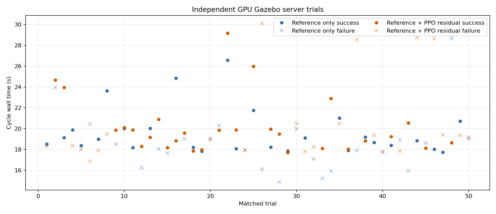
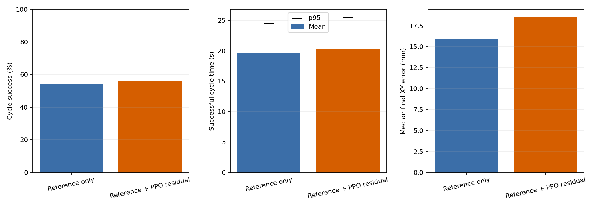
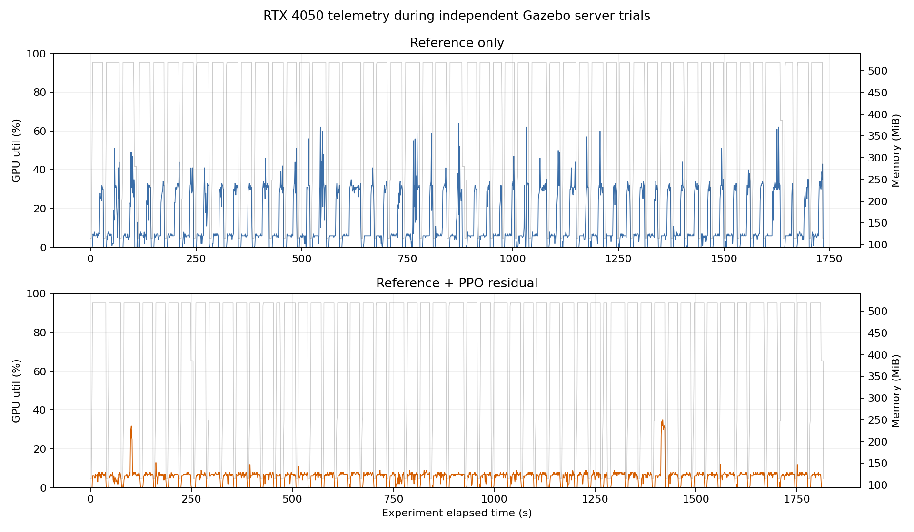

# `mp_control` 계열 고전 제어와 RL 50회 비교 결과

| 항목 | 실험 기준 |
|---|---|
| 실험일 | 2026-07-17 |
| 시뮬레이션 | MuJoCo `sim2real_robust` |
| 반복 | 제어기별 50 trial |
| trial 구성 | Pick episode 1회 + Place episode 1회 |
| seed | `20260717`에서 생성한 동일 50개 seed |
| 제어 주기 | `0.02 s`, 50 Hz |
| RL 정책 | `arm_delivery_residual_v2` |

## 1. 비교 범위

고전 제어군은 학습 환경의 결정론적 reference controller를 그대로
사용하고 PPO residual을 0으로 고정했다. RL군은 같은 reference에
학습된 PPO residual 10%를 더했다. 따라서 물체 위치·타워 크기·마찰·
관절 초기 오차·비전 잡음과 dropout이 seed별로 두 제어기에 동일하다.

> 이 고전 제어군은 `mp_control` 계열의 reference-only 대리군이다.
> ROS 2 C++ `mp_control_node`와 Gazebo를 50회 재실행한 결과는 아니므로,
> 연산 방식의 A/B 비교와 실제 통합 런타임 비교를 구분해야 한다.

## 2. 핵심 결과

| 지표 | 고전 reference 대리군 | RL residual | 판정 |
|---|---:|---:|---|
| Cycle 성공 | 45/50, 90% | 45/50, 90% | 동일 |
| Pick 성공률 | 90% | 90% | 동일 |
| Place 성공률 | 94% | 94% | 동일 |
| Cycle 충돌률 | 6% | 6% | 동일 |
| 성공 cycle 평균 | 19.770 s | **18.141 s** | **RL 1.629 s 단축** |
| 성공 cycle 중앙값 | 19.800 s | **18.120 s** | **RL 1.680 s 단축** |
| 성공 cycle p95 | 20.848 s | **18.956 s** | **RL 1.892 s 단축** |
| 성공 Pick 평균 | 9.885 s | **9.107 s** | RL 0.778 s 단축 |
| 성공 Place 평균 | 9.878 s | **9.028 s** | RL 0.850 s 단축 |
| RL 정책 추론 | 해당 없음 | 0.179 ms | 20 ms 주기의 0.9% |

두 제어기가 모두 성공한 44개 matched trial만 비교하면 RL이 44회 모두
빨랐다. RL 평균 단축량은 `1.626 s`, 시간 감소율은 `8.23%`, 속도비는
`1.09배`다. 평균 시간 차이의 95% 신뢰구간은 RL-고전 기준
`[-1.698, -1.554] s`이다.

## 3. 그래프


원은 Pick과 Place가 모두 성공한 trial이고, X는 둘 중 하나 이상이 실패한
trial이다. 충돌 실패는 episode가 즉시 종료되므로 시간이 짧게 표시된다.
따라서 시간 우위 판정은 전체 trial 평균이 아니라 성공 cycle과 matched
success를 기준으로 했다.


## 4. 실패 비교

| Trial | 위치 bucket | 고전 reference | RL residual |
|---:|---|---|---|
| 2 | `x_neg__y_neg` | Pick timeout | 성공 |
| 13 | `x_neg__y_neg` | Pick timeout | Pick timeout |
| 33 | `x_pos__y_pos` | Pick·Place 충돌 | Pick·Place 충돌 |
| 36 | `x_neg__y_neg` | 성공 | Pick timeout |
| 45 | `x_pos__y_mid` | Pick·Place 충돌 | Pick·Place 충돌 |
| 50 | `x_pos__y_neg` | Pick·Place 충돌 | Pick·Place 충돌 |

성공 건수는 같고 실패 seed 1개씩만 서로 바뀌었다. 충돌은 모두 양의 X
가장자리 bucket에서 발생했다. PPO residual이 속도는 단축했지만 이 조건의
최종 성공률과 충돌률을 개선하지는 못했다.

## 5. 판정

- **시간:** RL 우위. 공통 성공 44회 모두 빨랐고 평균 8.23% 단축했다.
- **성공률:** 우위 없음. 두 제어기 모두 90%다.
- **충돌률:** 우위 없음. 두 제어기 모두 6%다.
- **연산 부하:** 고전 제어가 작지만 RL 추론 0.179 ms는 50 Hz 마감에 충분하다.
- **후속 검증:** 동일 Gazebo world의 reference-only와 RL ROS 런타임
  50회 비교를 완료했다. 다만 실제 C++ `mp_control_node` 재생은 아니므로
  아래 Gazebo 결과도 reference 대리군 비교로 해석한다.

## 6. 재현·원본

```bash
cd /home/ktj/omx_turtle_ws/src
mkdir -p /tmp/omx_rl_matplotlib
/home/ktj/omx_train_ws/.venv/bin/python \
  omx_rl_control/tools/compare_reference_rl.py \
  --trials 50 \
  --seed 20260717 \
  --stage sim2real_robust \
  --output-dir docs/results/mp_vs_rl_50
```

| 파일 | 내용 |
|---|---|
| [`trials.csv`](./results/mp_vs_rl_50/trials.csv) | 제어기별 50회 원본 측정값 |
| [`summary.yaml`](./results/mp_vs_rl_50/summary.yaml) | 집계값, seed, 정책·설정 경로 |
| [`README.md`](./results/mp_vs_rl_50/README.md) | 스크립트 자동 생성 요약 |
| [`compare_reference_rl.py`](../omx_rl_control/tools/compare_reference_rl.py) | 실험·집계·그래프 재생성 스크립트 |

## 7. GPU Gazebo server 50회 A/B

MuJoCo 결과를 실제 ROS 2 trajectory, gripper action, Gazebo 접촉 물리를
포함하는 조건에서 다시 검증했다. 각 trial마다 Gazebo server와
ros2_control을 새로 시작해 이전 회차의 상태가 다음 회차에 남지 않게 했다.

| 실험 조건 | 값 |
|---|---|
| Gazebo | server-only, `-s --headless-rendering` |
| 렌더링 | OGRE2 Sensors, NVIDIA PRIME offload |
| PPO 추론 | RTX 4050 `cuda:0` |
| 물리·ROS | ODE와 ROS 2 executor는 CPU |
| 반복 | 제어기별 독립 server 50회 |
| Pick 위치 | X/Y 각각 ±10 mm, yaw ±0.3 rad |
| 물리 성공 | 타워 중심 XY 25 mm, Z 12 mm 이내 |

### 결과

| 지표 | Reference only | RL residual | 판정 |
|---|---:|---:|---|
| Cycle 성공 | 27/50, 54% | 28/50, 56% | 차이 2%p |
| 상태 완료 | 37/50 | 45/50 | RL 우위 |
| 완료 후 물리 실패 | **10회** | 17회 | Reference 우위 |
| 성공 cycle 평균 | **19.615 s** | 20.202 s | Reference 0.586 s 빠름 |
| 성공 cycle 중앙값 | **18.831 s** | 19.541 s | Reference 0.710 s 빠름 |
| 성공 cycle p95 | **24.470 s** | 25.527 s | Reference 1.057 s 빠름 |
| 완료 XY 오차 중앙값 | **15.9 mm** | 18.5 mm | Reference 우위 |

공통 성공은 15개 seed다. 이 중 RL이 빠른 회차는 5개, reference가 빠른
회차는 10개이며 RL-reference 평균 시간 차이는 `+0.691 s`다. Reference만
성공한 seed는 12개, RL만 성공한 seed는 13개, 둘 다 실패한 seed는
10개다. 따라서 이 Gazebo 조건에서는 RL의 성공률 우위를 주장할 수 없고,
시간과 최종 배치 정밀도는 reference-only가 더 좋다.







GPU active 구간은 전체 메모리 사용량 `300 MiB` 이상으로 정의했다.
Reference active 평균은 `15.4%`, p95 `34%`, 최대 `64%`였고 RL active
평균은 `6.6%`, p95 `8%`, 최대 `35%`였다. 두 군 모두 최대 메모리는
`520 MiB`다. PPO가 작은 MLP라 CUDA 사용률은 낮으며 Gazebo ODE 물리를
GPU로 옮길 수는 없다. GPU 사용률을 높이기 위한 인위적 렌더 부하는 제어
시간을 왜곡하므로 추가하지 않았다.

### Gazebo 재현 산출물

| 파일 | 내용 |
|---|---|
| [`README.md`](./results/gazebo_mp_vs_rl_50/README.md) | 자동 생성 요약표 |
| [`summary.yaml`](./results/gazebo_mp_vs_rl_50/summary.yaml) | 전체 집계와 paired·GPU 통계 |
| [`reference_only.csv`](./results/gazebo_mp_vs_rl_50/reference_only.csv) | Reference 50회 원본 |
| [`rl_residual.csv`](./results/gazebo_mp_vs_rl_50/rl_residual.csv) | RL 50회 원본 |
| [`reference_gpu.csv`](./results/gazebo_mp_vs_rl_50/reference_gpu.csv) | Reference GPU telemetry |
| [`rl_gpu.csv`](./results/gazebo_mp_vs_rl_50/rl_gpu.csv) | RL GPU telemetry |
| [`gazebo_server_batch.py`](../omx_rl_control/tools/gazebo_server_batch.py) | 독립 server 반복 실행기 |
| [`summarize_gazebo_ab.py`](../omx_rl_control/tools/summarize_gazebo_ab.py) | 집계·그래프 생성기 |
