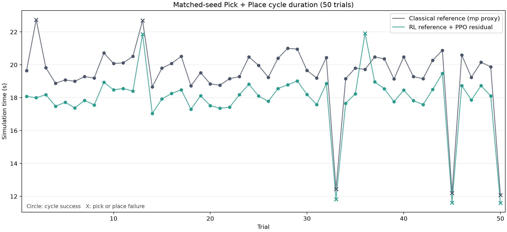
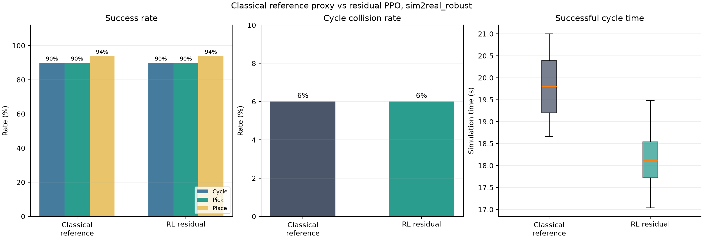

# Classical reference proxy vs RL: 50-trial result

| Item | Value |
|---|---|
| Stage | `sim2real_robust` |
| Trials | `50` matched seeds |
| Trial definition | Pick episode + Place episode |
| Master seed | `20260717` |
| Policy | `/home/ktj/omx_train_ws/policies/latest/arm_delivery_residual_v2/arm_grasp_latest.zip` |
| Control timestep | `0.02 s` |

> The classical group is the environment's deterministic reference controller with the PPO residual fixed to zero. It is an mp_control proxy, not a replay of the C++ mp_control ROS node.

## Summary

| Metric | Classical reference proxy | RL residual |
|---|---:|---:|
| Cycle success | 45/50 | 45/50 |
| Cycle success rate | 90.0% | 90.0% |
| Pick success rate | 90.0% | 90.0% |
| Place success rate | 94.0% | 94.0% |
| Cycle collision rate | 6.0% | 6.0% |
| Mean successful cycle time (s) | 19.770 | 18.141 |
| Median successful cycle time (s) | 19.800 | 18.120 |
| P95 successful cycle time (s) | 20.848 | 18.956 |
| Mean successful Pick time (s) | 9.885 | 9.107 |
| Mean successful Place time (s) | 9.878 | 9.028 |
| Mean policy inference (ms) | 0.000 | 0.179 |

## Paired successful trials

| Metric | Result |
|---|---:|
| Both controllers succeeded | 44 |
| Classical paired mean time (s) | 19.771 |
| RL paired mean time (s) | 18.145 |
| Mean RL - classical time (s) | -1.626 |
| Median RL - classical time (s) | -1.590 |
| Mean delta 95% CI (s) | [-1.698, -1.554] |
| RL time reduction | 8.226% |
| Classical / RL speed ratio | 1.090x |
| RL faster | 44 |
| Classical faster | 0 |
| Ties | 0 |
| Two-sided sign-test p | 1.137e-13 |

## Figures

Raw per-trial values are stored in `trials.csv`; machine-readable aggregate values are stored in `summary.yaml`.
