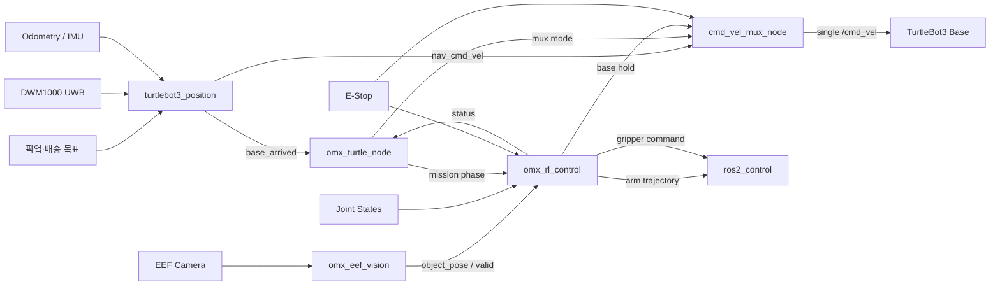
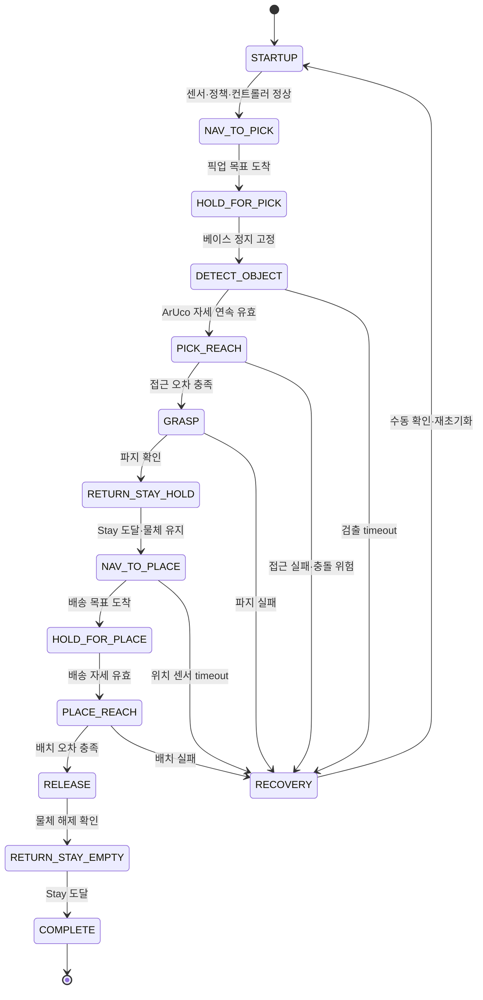

# 지능로봇경진대회 배송로봇 최종 기획 및 진행 계획

| 항목 | 값 |
|---|---|
| 기준일 | 2026-07-17 |
| 기준 워크스페이스 | `/home/ktj/omx_turtle_ws` |
| 학습 워크스페이스 | `/home/ktj/omx_train_ws` |

### 상세 계획서

| 영역 | 문서 |
|---|---|
| UWB 위치·주행 | [UWB 위치 제어 계획서](<./UWB 위치 제어 계획서.md>) |
| EEF ArUco 비전 | [OMX EEF 비전 계획서](<./OMX EEF 비전 계획서.md>) |
| PPO 팔 제어 | [OMX RL 제어 계획서](<./OMX RL 제어 계획서.md>) |

## 1. 프로젝트 목표

TurtleBot3 Waffle Pi가 UWB 좌표를 이용해 픽업 지점으로 이동하고, EEF 카메라의 ArUco 자세를 기준으로 비정형 위치의 상자를 파지한 뒤 배송 지점의 동일 규격 타워에 배치한다.

| 구성 | 최종 기준 |
|---|---|
| 이동 플랫폼 | TurtleBot3 Waffle Pi |
| 매니퓰레이터 | OpenMANIPULATOR-X, `joint1`~`joint4` |
| 연산 장치 | Jetson Orin Nano |
| 물체 인식 | EEF USB 카메라 + ArUco, YOLO 미사용 |
| 전역 위치 | DWM1000 UWB + odometry/IMU yaw |
| 팔 제어 | MuJoCo에서 학습한 PPO residual policy |
| 배송 상자 | `6 x 5.5 x 5.5 cm` 직육면체 |
| 픽업·배송 타워 | 각각 `13 x 13 x 17 cm` |
| 통합 launch | `turtlebot3_control/launch/omx_turtle.launch.py` |

### 범위

- 타워 상면의 일정하지 않은 위치와 yaw에 놓인 상자를 파지한다.
- 팔이 접근하는 동안에는 ArUco 자세를 계속 반영한다.
- 파지 후에는 물체를 유지한 채 Stay 자세로 복귀한다.
- 배송 위치 도착 후 팔을 전개해 상자를 놓고 빈 팔로 Stay 자세까지 복귀한다.
- 주행, 팔, 그리퍼의 명령 소유권을 분리하고 timeout 시 정지한다.

### 제외 범위

- 라인팔로워 기반 주행
- YOLO 또는 별도 객체 검출 모델
- PPO를 이용한 TurtleBot3 베이스 속도 제어
- PPO를 이용한 그리퍼 개폐 결정
- 원통, 봉투, 연성 물체 등 학습하지 않은 형상의 파지 보장

## 2. 최종 시스템 구조

### 제어 소유권

| 대상 | 단독 명령 소유자 | 규칙 |
|---|---|---|
| `/cmd_vel` | `cmd_vel_mux_node` | 다른 노드는 `/cmd_vel`을 직접 발행하지 않음 |
| 주행 목표와 도착 판정 | `turtlebot3_position` | 출력은 `nav_cmd_vel`, `base_arrived`로 제한 |
| 팔 `joint1`~`joint4` | `omx_rl_control` | RL 전환 후 기존 `mp_control`과 동시 실행 금지 |
| 그리퍼 | `omx_rl_control` 상태 머신 | PPO action에 포함하지 않음 |
| 물체 자세 | `omx_eef_vision` | 자세만 발행하며 관절·속도 명령은 발행하지 않음 |
| 전체 임무 순서 | `omx_turtle_node` | 이동, 파지, 배송, 배치 상태 전이를 관리 |

## 3. 최종 임무 순서

| 순서 | 동작 | 완료 조건 | 실패 시 동작 |
|---:|---|---|---|
| 1 | UWB 목표로 픽업 타워 접근, EEF 카메라로 ArUco 확인 | 목표 거리 도달, 속도 0, 자세 유효 | 주행 정지 후 센서 재확인 |
| 2 | 베이스를 Hold하고 팔 접근 시작 | `/cmd_vel=0`, 팔 접근 전용 제어권 확보 | 즉시 Hold |
| 3 | 팔이 완전히 접근할 때까지 물체 자세 보정 | EEF-파지 목표 위치·방향 오차 충족 | 자세 만료 시 팔 정지 또는 후퇴 |
| 4 | 그리퍼 최대 개방 후 목표를 고정하고 파지 | 파지 명령 완료와 물체 유지 확인 | 한정 재시도 후 Recovery |
| 5 | 물체를 잡은 채 Stay 자세 복귀 | 관절 오차 허용 범위, 물체 유지 | 베이스 이동 금지 |
| 6 | UWB 배송 목표로 이동 | 도착 신호가 안정적으로 유지됨 | timeout 시 베이스 정지 |
| 7 | 배송 타워로 팔 전개 후 물체 배치 | 배치 자세 도달, 그리퍼 개방, 물체 분리 | 팔 Hold 후 Recovery |
| 8 | 빈 팔 Stay 복귀 후 임무 완료 | Stay 도달, 베이스 Hold, 오류 없음 | 완료를 발행하지 않음 |

배송 완료는 배송 위치 도착이나 그리퍼 개방만으로 선언하지 않는다. **물체 해제와 빈 팔의 Stay 복귀**까지 확인해야 한다.

## 4. 패키지별 현재 진행 상태

| 패키지·영역 | 현재 결과 | 상태 | 다음 작업 |
|---|---|---|---|
| `omx_eef_vision` | ArUco 검출, IPPE 자세 추정, TF 변환, 품질·timeout 필터, debug 출력 구현 | 검증 대기 | 실카메라 보정, 마커 실측, TF·정확도 표 작성 |
| `turtlebot3_control` launch | 최종 진입점을 `omx_turtle.launch.py`로 통일 | 부분 완료 | position과 RL launch 포함, legacy 경로 제거 |
| `cmd_vel_mux_node` | `NAV/PICK/HOLD/STOP`, freshness timeout, `/cmd_vel` 단독 발행 구현 | 부분 완료 | E-Stop 입력과 전체 상태 전이 시험 |
| `omx_turtle_node` | 도착·ArUco gate 후 `NAVIGATING -> PICKING -> DONE/ERROR` 구현 | 부분 완료 | 배송 이동과 PLACE를 포함한 전체 상태 머신으로 확장 |
| 라인팔로워 제거 | 현재 프로젝트 launch·토픽·의존성에서 제거 | 완료 | 재도입 금지 |
| `turtlebot3_position` | 디렉터리와 UWB 상세 계획만 존재 | 구현 대기 | DWM1000 raw 형식 확인 후 ROS 2 패키지 생성 |
| `omx_rl_control` | 정책 배포, 33D parity, PPO 추론, trajectory·gripper 상태 머신, fake·Gazebo Pick-Place 구현 | 부분 완료 | Vision replay와 저속 실기기 반복 시험 |
| PPO 학습 | 최종 정책과 100 episode 조건별 평가 확보 | 완료(시뮬레이션) | fake hardware, 저속 실기기, 끝단 충돌 보완 |
| 실기기 전체 배송 | 아직 실행 근거 없음 | 구현 대기 | 단계별 gate 통과 후 반복 시험 |

### 현재 통합 launch의 한계

`omx_turtle.launch.py`는 아직 `mp_control`, `aruco_mp_bridge`, MoveIt Servo를
사용하는 legacy 팔 제어 경로를 포함한다. `omx_rl_control` 패키지는 구현됐지만
최종 통합 launch에는 아직 연결하지 않았다. 통합 시 legacy 경로를 **교체**하고
두 팔 제어기를 동시에 실행하지 않는다. 또한 `turtlebot3_position`이 아직
없으므로 현재 `nav_cmd_vel`을 생성하는 최종 주행 구현도 없다.

## 5. 강화학습 모델 기준

| 항목 | 현재 기준 |
|---|---|
| 학습 저장소 | `/home/ktj/omx_train_ws` |
| 최종 정책 | `policies/latest/arm_delivery_residual_v3_robot_stay/arm_grasp_latest.zip` |
| 모델 크기 | `1,842,792 bytes` |
| SHA-256 | `07b69c0680521413ca8c40bf37c93993d74d47ccedc48f0c2ab7cb0a7991d6fe` |
| 관측·행동 | `33D` observation, `4D` arm action |
| 제어 주기 | `0.02 s` |
| 제어 방식 | 기준 경로 + `10%` PPO residual |

| 시뮬레이션 평가 조건 | 성공률 | 충돌률 |
|---|---:|---:|
| 정형 중앙 파지 | 100% | 0% |
| 정형 중앙 배치·복귀 | 100% | 0% |
| 전체 타워 비정형 파지 | 98% | 2% |
| 전체 타워 비정형 배치·복귀 | 99% | 1% |
| Pick/Place 혼합 | 99% | 1% |
| 전체 Sim2Real randomization | 95% | 5% |

- 현재 모델은 시뮬레이션 기준 최종본이며 실기기 최종본으로 판정하지 않는다.
- 주요 실패 구간은 로봇 기준 양의 X 방향 타워 끝단이다.
- 정책 배포 시 ZIP만 복사하지 않고 `policy_metadata.yaml`, `training_config.yaml`, 평가 결과와 checksum을 함께 고정한다.
- 런타임은 `/home/ktj/omx_train_ws`를 직접 참조하지 않는다. 검증된 버전을 `omx_rl_control/models/policies/arm_delivery_residual_v3_robot_stay/`에 배포한다.

## 6. ROS 2 인터페이스 기준

| 구현 상태 | 인터페이스 | 타입 | 발행 → 구독 | 목적 |
|---|---|---|---|---|
| 발행 구현 | `/target/object_pose` | `geometry_msgs/msg/PoseStamped` | Vision → RL | `base_link` 기준 파지 목표 |
| 발행 구현 | `/target/valid` | `std_msgs/msg/Bool` | Vision → RL·Coordinator | 필터를 통과한 자세 유효성 |
| 연결 구현 | `/target/aruco_visible` | `std_msgs/msg/Bool` | Vision → Coordinator | 마커 검출 freshness gate |
| 구독만 구현 | `/turtlebot3_control/nav_cmd_vel` | `geometry_msgs/msg/Twist` | Position → Mux | UWB 목표점 이동 명령 |
| 구독만 구현 | `/turtlebot3_control/base_arrived` | `std_msgs/msg/Bool` | Position → Coordinator | 도착·안정화 상태 |
| 연결 구현 | `/turtlebot3_control/mux_mode` | `std_msgs/msg/String` | Coordinator → Mux | `NAV/PICK/HOLD/STOP` 선택 |
| 구독만 구현 | `/target/base_hold` | `std_msgs/msg/Bool` | Arm control → Mux | 팔 동작 중 베이스 강제 정지 |
| 발행 구현 | `/cmd_vel` | `geometry_msgs/msg/Twist` | Mux → Base | 실제 베이스 최종 명령 |
| 예정 | `/turtlebot3_position/goal` | `geometry_msgs/msg/PoseStamped` | Coordinator → Position | 픽업·배송 UWB 목표 |
| 예정 | `/turtlebot3_position/enable` | `std_msgs/msg/Bool` | Coordinator → Position | 주행 제어 활성화 |
| 임시 구현 | `/rl_control/command` | `std_msgs/msg/String` | Coordinator → RL | `PICK`, `PLACE`, `HOLD`, `RESET`, `E_STOP` |
| 구현 | `/rl_control/status` | `std_msgs/msg/String` | RL → Coordinator | 상태, 상세 원인, 모델 버전, 파지 상태 |
| 예정 | `/safety_stop` | `std_msgs/msg/Bool` | Safety → Mux·RL | 출력 즉시 차단 |

현재 문자열 명령·상태는 통합 전 임시 계약이다. 취소, feedback, 결과가 필요한
최종 임무 인터페이스는 전용 ROS 2 Action 승격 여부를 검토하며, 자유 형식
문자열을 장기 계약으로 고정하지 않는다.

## 7. 구현 순서와 완료 기준

의존성이 없는 UWB 입력 확인과 RL 모델 배포 준비는 병렬로 진행한다. 실제 로봇 통합은 replay와 fake hardware를 통과한 뒤 수행한다.

| 단계 | 핵심 작업 | 완료 기준 | 상태 |
|---|---|---|---|
| P0. 기준 고정 | 문서 분리, 책임·토픽·완료 조건 기준안 작성 | 최종·UWB·EEF·RL 계획서가 `docs/`에서 연결됨 | 완료 |
| P1. UWB 입력 | DWM1000 연결, raw sample, anchor 좌표와 tag offset 확보 | 형식·단위·주기·timeout이 기록됨 | 대기 |
| P2. 위치 제어 | `turtlebot3_position` 패키지, 필터, 목표점 controller 구현 | replay에서 제한 속도·감속·도착 hysteresis 통과 | 대기 |
| P3. RL 배포 | 정책·metadata 고정, 관측 builder, 추론, 관절 제한 구현 | 고정 입력 출력 재현, checksum·33D 순서 검증 | 완료 |
| P4. Fake·Gazebo 통합 | fake ros2_control과 Gazebo에서 파지 → Stay → 배치 | 전체 팔 상태 전이와 타워 물리 배치 완료 | 완료(고정 위치) |
| P5. 실기기 팔 | 카메라 보정, 저속 무부하, 상자 파지·배치 시험 | E-Stop·timeout 통과, 충돌 없는 반복 결과 기록 | 대기 |
| P6. 실기기 주행 | UWB 저속 목표점 이동과 도착 신호 통합 | 목표별 도착 오차와 센서 단절 시험 통과 | 대기 |
| P7. 전체 임무 | 픽업 이동 → 파지 → 배송 이동 → 배치 → Stay | 단일 launch에서 정상·실패 흐름 모두 재현 | 대기 |
| P8. 대회 안정화 | 반복 시험, 재시도 제한, 운영 절차와 spare 설정 고정 | 내부 대회 준비 기준 통과 | 대기 |

### 바로 진행할 작업

1. DWM1000의 실제 연결 방식과 출력 한 줄을 확보하고 anchor 배치도를 기록한다.
2. `turtlebot3_position`을 ROS 2 패키지로 생성해 raw 수신과 replay 시험부터 구현한다.
3. EEF Vision rosbag을 RL 입력에 연결해 위치 갱신, dropout, timeout을 반복 검증한다.
4. 실기기에서 무부하 Stay와 그리퍼 Open·Close를 저속으로 확인한다.
5. 중앙 상자 Pick·Place를 각각 10회 반복하고 충돌·낙하·수동 개입을 기록한다.
6. 실카메라 ArUco 오차와 실제 Dynamixel 지연을 측정해 Sim2Real 파라미터에 반영한다.
7. UWB 이동과 팔 상태 머신을 연결하고 전체 반복 시험표를 작성한다.

## 8. 시험 게이트

| Gate | 시험 | 통과 조건 |
|---|---|---|
| G1 Vision | 정지·이동 카메라, 타워 상면 위치·yaw 변화 | pose 단위·축·TF가 실측과 일치하고 timeout 시 즉시 invalid |
| G2 UWB | 정지 분산, 기준점 이동, anchor 단절 | 오차·갱신 주기 기록, 단절 후 속도 0 |
| G3 Position | rosbag/replay 목표점 이동 | 속도·가속도 제한, overshoot·hysteresis·목표 변경 통과 |
| G4 RL Offline | 정책 로딩과 고정 observation | checksum, 차원, 정규화, 결정적 출력 확인 |
| G5 Fake Hardware | 팔 전체 상태 전이 | 관절 한계 초과·NaN·timeout·명령 충돌 0건 |
| G6 Real Arm | 저속 무부하 → 상자 파지 → 배치 | E-Stop 가능, 타워 충돌 없는 결과표 확보 |
| G7 Base + Arm | 이동 중 Stay·grip 유지, 도착 후 arm gate | 팔 동작 중 `/cmd_vel=0`, 이동 중 팔 Stay 유지 |
| G8 Full Mission | 시작부터 배송 완료까지 반복 | 성공률·실패 원인·복구 결과가 기록되고 비통제 충돌 0건 |

대회 준비를 위한 내부 잠정 기준은 실기기 전체 임무 20회에서 성공률 90% 이상, 비통제 충돌 0회, 센서 timeout 시 정지 100%다. 실제 대회 규정의 시간·오차 조건이 확인되면 해당 수치로 교체한다.

## 9. 주요 위험과 대응

| 위험 | 영향 | 대응 |
|---|---|---|
| 양의 X 타워 끝단 충돌 | 파지·배치 실패, 하드웨어 손상 | workspace margin, 접근 전 collision gate, 해당 영역 집중 재학습 |
| ArUco 가림·잘못된 marker size | 잘못된 거리로 팔 이동 | 연속 valid, reprojection 검사, 실측 크기·CameraInfo 고정 |
| EEF 카메라 TF 오차 | 목표 좌표 전체 편향 | hand-eye/고정 TF 실측, 기준점 오차표 작성 |
| UWB jump·anchor 손실 | 경로 이탈 | outlier 거부, covariance·freshness, odom yaw 결합, timeout 정지 |
| Sim2Real 동역학 차이 | 진동·충돌·파지 실패 | residual 비율과 속도 제한을 낮춰 시작, 실측 로그로 재학습 |
| 팔 제어기 중복 실행 | 상충하는 관절 명령 | launch에서 legacy와 RL을 상호 배타적으로 구성 |
| 이동 중 물체 낙하 | 배송 실패 | 그리퍼 유지 명령, Stay 고정, 가능한 경우 부하·물체 추종 감시 |
| 완료 신호 오판 | 물체 없이 다음 단계 진행 | 파지·해제·Stay를 각각 확인하고 timeout·재시도 횟수 제한 |
| 비상정지 미연결 | 실기기 위험 | Mux와 RL 출력단 모두 `/safety_stop` 적용 후에만 실물 파지 |

## 10. 결정이 필요한 항목

- DWM1000이 anchor range를 주는지 계산된 `x, y`를 주는지
- anchor 개수, 경기장 좌표, UWB tag의 `base_link` offset
- 픽업·배송 목표 좌표를 입력하는 상위 장치와 메시지 방식
- 배송 타워에도 ArUco를 사용할지, 보정된 고정 배치 자세를 사용할지
- 실제 인쇄 마커의 Dictionary, ID, 검은 사각형 한 변 길이
- 그리퍼 전류·부하 피드백 사용 가능 여부
- 대회 규정의 제한 시간, 목표 위치 허용오차, 재시도 허용 횟수

이 항목들이 확인되기 전에는 serial parser, 위치 필터 gain, 주행 속도, 최종 파지 임계값을 확정하지 않는다.

## 11. 최종 완료 정의

다음 조건을 모두 만족해야 프로젝트를 완료로 판정한다.

- `omx_turtle.launch.py` 한 번으로 필요한 하드웨어, UWB, Vision, RL, Mux, Coordinator가 실행된다.
- `/cmd_vel`과 팔 trajectory에 각각 단일 명령 소유자가 유지된다.
- 비정형 위치 상자를 ArUco로 확인하고, 접근 중 보정해 파지한다.
- 물체를 잡은 채 Stay로 복귀하고 배송 이동 중 파지를 유지한다.
- 배송 타워에 물체를 놓고 빈 팔 Stay 복귀 후에만 완료를 발행한다.
- UWB, 카메라, TF, 정책, 관절 상태 중 하나라도 만료되면 안전 정지한다.
- 시뮬레이션, fake hardware, 실기기 결과를 구분한 반복 시험표가 남아 있다.
- 실행 절차, 파라미터, 모델 checksum, 실패 복구 절차가 `docs/`에 최신 상태로 기록되어 있다.
