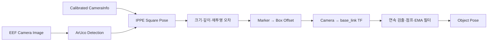

# OMX EEF Vision

OpenMANIPULATOR-X의 EEF USB 카메라에서 ArUco 마커를 검출하고 배송 상자의 6D 자세를 생성하는 ROS 2 패키지다. YOLO나 별도 객체 검출 모델은 사용하지 않는다.

## 처리 흐름



마커가 영상에 보이는 것만으로 팔을 움직이지 않는다. 카메라 보정, 자세 품질, TF, 작업영역과 연속 검출 조건을 모두 통과한 경우에만 `/target/valid=true`를 발행한다.

## 인터페이스

| 구분 | 토픽 | 타입 | 의미 |
|---|---|---|---|
| 입력 | `/eef_camera/image_raw` | `sensor_msgs/msg/Image` | EEF USB 카메라 영상 |
| 입력 | `/eef_camera/camera_info` | `sensor_msgs/msg/CameraInfo` | 보정된 카메라 내부 파라미터 |
| 출력 | `/target/aruco_pose` | `geometry_msgs/msg/PoseStamped` | 카메라 optical frame 기준 원시 마커 자세 |
| 출력 | `/target/object_pose` | `geometry_msgs/msg/PoseStamped` | 필터를 통과한 `base_link` 기준 상자 목표 자세 |
| 출력 | `/target/aruco_visible` | `std_msgs/msg/Bool` | 설정한 마커가 현재 영상에서 검출됨 |
| 출력 | `/target/valid` | `std_msgs/msg/Bool` | 제어기가 목표 자세를 사용해도 됨 |
| 출력 | `/target/aruco_status` | `std_msgs/msg/String` | 대기·거부·검출 상태와 수치 |
| 출력 | `/target/aruco_debug_image` | `sensor_msgs/msg/Image` | 코너, 축과 품질 수치가 표시된 영상 |

`/target/aruco_pose`와 `/target/aruco_visible`은 기존 `aruco_mp_bridge` 호환 출력이다. RL 제어기는 `/target/object_pose`와 `/target/valid`를 사용한다.

## 기준 설정

| 항목 | 기본값 | 확인 사항 |
|---|---:|---|
| Dictionary | `DICT_APRILTAG_36h11` | 실제 인쇄한 마커와 반드시 일치 |
| Marker ID | `0` | `accept_any_marker=false` 사용 시 필수 |
| Marker size | `0.05 m` | 검은 정사각형 한 변을 실측 |
| 안정 검출 | `3 frames` | 연속 통과 전에는 `valid=false` |
| 최대 재투영 오차 | `8 px` | 높으면 자세가 흔들리므로 거부 |
| 출력 좌표계 | `base_link` | EEF 카메라 TF 필요 |
| 영상 timeout | `1.0 s` | 초과 시 즉시 무효화 |

현재 기본 Dictionary와 크기는 기존 ArUco 설정을 이어받은 값이다. 실제 대회용 마커가 다르면 `config/eef_vision.yaml`을 먼저 수정한다.

## 상자 중심 보정

ArUco가 주는 위치는 마커 중심이다. 파지 목표가 상자 중심과 다르면 마커 좌표계 기준 변환을 설정한다.

```yaml
object_offset_xyz: [0.0, 0.0, 0.0]
object_offset_rpy: [0.0, 0.0, 0.0]
```

배송 상자는 `6 × 5.5 × 5.5 cm`지만, 마커를 어느 면과 방향으로 부착하는지에 따라 부호가 달라진다. 임의로 `2.75 cm`를 적용하지 말고 `drawFrameAxes`의 축 방향을 확인한 뒤 측정값을 넣는다.

## 실행

EEF 카메라 드라이버와 robot state publisher가 먼저 실행 중이어야 한다. `omx_eef_vision` launch는 카메라 드라이버를 중복 실행하지 않는다.

```bash
cd /home/ktj/omx_turtle_ws
source /opt/ros/humble/setup.bash
colcon build --packages-select omx_eef_vision
source install/setup.bash
ros2 launch omx_eef_vision eef_vision.launch.py
```

기본 카메라 보정 파일은 `turtlebot3_manipulation_bringup/config/eef_usb_camera.yaml`이며 하드웨어 launch가 `v4l2_camera`에 전달한다. `/eef_camera/camera_info`의 `K[0]`, `K[4]`가 0이면 자세를 발행하지 않는다.

## 확인

```bash
ros2 topic hz /eef_camera/image_raw
ros2 topic echo /eef_camera/camera_info --once
ros2 topic echo /target/aruco_status
ros2 topic echo /target/aruco_pose --once
ros2 topic echo /target/object_pose --once
ros2 topic echo /target/valid
```

디버그 영상은 RViz의 Image display 또는 `rqt_image_view /target/aruco_debug_image`로 확인한다. 마커가 보이는데도 자세가 나오지 않으면 status에서 Dictionary, ID, perimeter, depth, reprojection error와 TF 실패를 순서대로 확인한다.

## 안전 원칙

- 마지막 정상 자세를 무기한 재사용하지 않는다.
- 영상·검출 timeout, TF 실패, 작업영역 이탈 시 `valid=false`를 발행한다.
- `accept_any_marker=true`는 장면에 마커가 하나뿐일 때만 사용한다.
- 실제 marker size나 CameraInfo가 틀리면 거리도 같은 비율로 틀어지므로 실측과 캘리브레이션을 생략하지 않는다.
