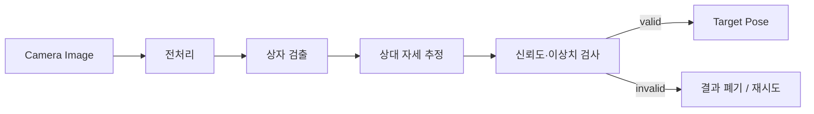
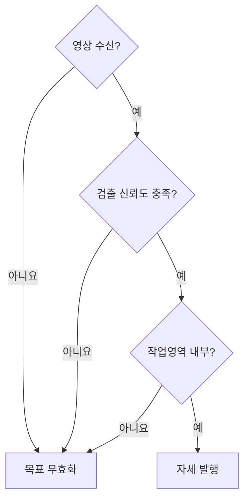

# omx_eef_vision

OpenMANIPULATOR-X의 EEF 카메라 영상을 받아 **배송 상자의 상대 위치와 자세를 생성하는 ROS 2 패키지**다. 제어기가 영상 처리 방식에 의존하지 않도록, 검출 결과를 표준 ROS 메시지로 변환하는 경계를 담당한다.

> **구현 상태:** `ament_python` 패키지 구조만 생성됨. 노드, launch, 설정값, 검출 모델은 미구현 상태다.

## 처리 흐름



검출 여부만 전달하지 않고, 제어에 사용할 수 있는 좌표계·시각·신뢰 조건을 갖춘 목표 자세를 발행하는 것이 패키지의 완료 기준이다.

## 책임 범위

| 포함 | 제외 |
|---|---|
| 카메라 영상 구독과 변환 | 매니퓰레이터 관절 제어 |
| 상자 검출 및 자세 추정 | TurtleBot3 주행 제어 |
| 좌표계와 타임스탬프 부여 | PPO 정책 추론 |
| 신뢰도·작업영역 필터링 | 중앙 서버 임무 관리 |

## 인터페이스 초안

| 구분 | 이름 | 타입 | 설명 |
|---|---|---|---|
| 입력 | `/camera/image_raw` | `sensor_msgs/msg/Image` | EEF USB 카메라 영상 |
| 출력 | `/target/object_pose` | `geometry_msgs/msg/PoseStamped` | EEF 또는 카메라 기준 상자 목표 자세 |
| 출력 | `/target/valid` | `std_msgs/msg/Bool` | 현재 목표 자세의 사용 가능 여부 |

좌표계는 카메라 드라이버와 TF 구성이 확정된 뒤 `header.frame_id` 하나로 통일한다. 서로 다른 기준 좌표가 섞인 자세는 발행하지 않는다.

## 설정 기준

`config/eef_vision.yaml`에는 다음 범주의 값만 둔다.

| 범주 | 예시 | 목적 |
|---|---|---|
| 입력 | 영상 토픽, 처리 해상도 | 카메라 교체 대응 |
| 검출 | 모델 경로, 신뢰도 임계값 | 오검출 억제 |
| 기하 | 카메라 내부 파라미터, 상자 크기 | 자세 추정 |
| 필터 | 이동 평균 길이, 최대 위치 변화량 | 출력 흔들림 억제 |
| 출력 | 기준 좌표계, 발행 주기 | 제어기 계약 유지 |

## 실패 처리



마지막 정상값을 무기한 재사용하지 않는다. 영상 타임아웃이나 연속 검출 실패 시 목표를 무효화해 제어기가 정지할 수 있어야 한다.

## 디렉터리

```text
omx_eef_vision/
├── config/eef_vision.yaml          # 영상·검출·필터 파라미터
├── launch/eef_vision.launch.py     # 노드 실행 구성
├── models/                         # 검출 모델 및 버전 정보
└── omx_eef_vision/
    └── eef_vision_node.py          # ROS 2 노드
```

구현 후에는 `setup.py`에 실행 진입점과 `launch/`, `config/`, `models/` 설치 규칙을 추가해야 한다.

## 검증 기준

| 시험 | 확인 항목 |
|---|---|
| 녹화 영상 재생 | 같은 입력에서 동일한 검출 결과 재현 |
| 정지 상자 | 출력 위치의 분산과 자세 흔들림 |
| 비정렬 상자 | 허용 작업영역 내 위치·각도 변화 대응 |
| 가림·조명 변화 | 잘못된 목표 대신 `valid=false` 출력 |
| 카메라 단절 | 타임아웃 후 목표 즉시 무효화 |
