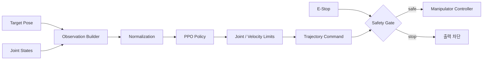
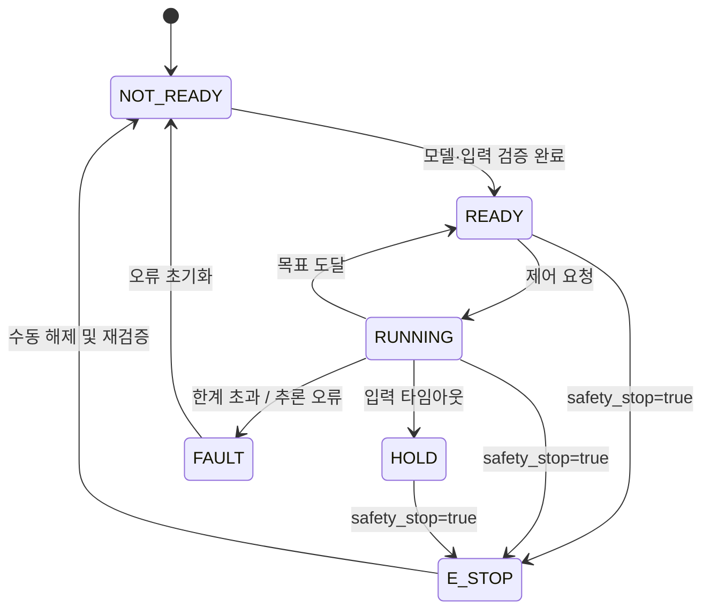

# omx_rl_control

상자 목표 자세와 OpenMANIPULATOR-X의 현재 상태를 관측값으로 구성해 **PPO 정책을 추론하고 안전한 관절 명령으로 변환하는 ROS 2 패키지**다. 학습 모델의 원시 출력을 하드웨어에 바로 전달하지 않고, 관절 한계·속도·통신 상태를 검사하는 실행 계층을 둔다.

> **구현 상태:** `ament_python` 패키지 구조만 생성됨. 노드, launch, 설정값, PPO 모델은 미구현 상태다.

## 제어 루프



정책 추론과 안전 판정을 분리한다. 모델이 비정상 값을 내거나 입력 데이터가 오래되면, 이전 명령을 유지하지 않고 정지 자세 또는 출력 차단으로 전환한다.

## 책임 범위

| 포함 | 제외 |
|---|---|
| 관측값 조합·정규화 | 카메라 영상 검출 |
| PPO 모델 로딩과 추론 | PPO 학습 환경 구현 |
| 정책 출력을 관절 명령으로 변환 | TurtleBot3 경로 계획 |
| 관절·속도·주기·타임아웃 제한 | 중앙 서버 임무 스케줄링 |
| 상태와 오류 코드 발행 | UWB 위치 계산 |

## 인터페이스 초안

| 구분 | 이름 | 타입 | 설명 |
|---|---|---|---|
| 입력 | `/target/object_pose` | `geometry_msgs/msg/PoseStamped` | Vision이 생성한 상자 목표 자세 |
| 입력 | `/joint_states` | `sensor_msgs/msg/JointState` | 현재 관절 위치와 속도 |
| 입력 | `/safety_stop` | `std_msgs/msg/Bool` | 비상 정지 및 상위 안전 차단 |
| 출력 | 컨트롤러 명령 인터페이스 | `trajectory_msgs/msg/JointTrajectory` | 제한을 적용한 관절 목표 |
| 출력 | `/rl_control/status` | `std_msgs/msg/String` | 준비·실행·정지·오류 상태 |

실제 컨트롤러의 토픽 또는 Action 이름은 OpenMANIPULATOR-X bringup 구성에 맞춰 확정한다. README의 임의 이름에 하드웨어 구성을 맞추지 않는다.

## 모델 계약

`models/`에 가중치만 두지 않고 아래 정보를 함께 고정해야 한다.

| 항목 | 기록 내용 |
|---|---|
| 모델 식별자 | 파일명, 체크섬, 학습 완료 시각 |
| 학습 환경 | MuJoCo 버전, 로봇 모델, 제어 주기 |
| 관측값 | 필드 순서, 단위, 정규화 범위 |
| 행동값 | 관절 순서, 위치/속도 의미, 스케일 |
| 종료 조건 | 성공, 실패, 타임아웃 판정 |
| Sim2Real | 지연·노이즈·마찰·질량 랜덤화 범위 |

관측값 순서나 정규화 범위가 학습 시점과 다르면 모델 파일이 정상이어도 제어는 실패한다. 노드 시작 시 메타데이터를 검사하고 계약이 맞지 않으면 추론을 시작하지 않는 방향으로 구현한다.

## 안전 조건



| 조건 | 기본 동작 |
|---|---|
| 목표 자세 또는 관절 상태 타임아웃 | 새 명령 발행 중단 |
| NaN·Inf 또는 출력 차원 불일치 | `FAULT` 전환 |
| 관절 위치·속도 한계 초과 | 명령 거부 후 정지 |
| 추론 주기 지연 | 해당 주기 명령 폐기 |
| E-Stop 수신 | 즉시 출력 차단, 자동 재시작 금지 |

## 디렉터리

```text
omx_rl_control/
├── config/rl_control.yaml          # 모델·관측·출력·안전 파라미터
├── launch/rl_control.launch.py     # 노드 및 컨트롤러 연결
├── models/                         # PPO 가중치와 모델 메타데이터
└── omx_rl_control/
    └── rl_control_node.py          # ROS 2 추론 노드
```

구현 후에는 `setup.py`에 실행 진입점과 `launch/`, `config/`, `models/` 설치 규칙을 추가해야 한다.

## 검증 기준

| 단계 | 통과 조건 |
|---|---|
| 모델 로딩 | 잘못된 경로·버전·입력 차원을 명확한 오류로 거부 |
| 오프라인 추론 | 고정 관측값에서 동일한 행동값 재현 |
| 제한기 시험 | 범위를 벗어난 정책 출력을 하드웨어 한계 안으로 처리 |
| Fake hardware | 실제 모터 없이 명령 형식과 상태 전이 확인 |
| 저속 실기기 | 무부하·저속 조건에서 E-Stop과 타임아웃 우선 검증 |
| 파지 통합 | Vision 목표 변화에 따라 접근·파지 동작 반복 확인 |
