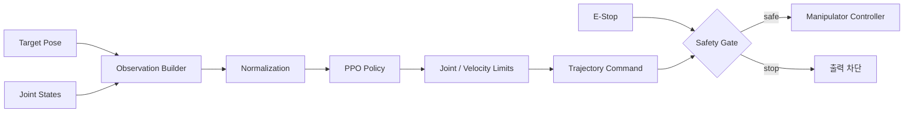
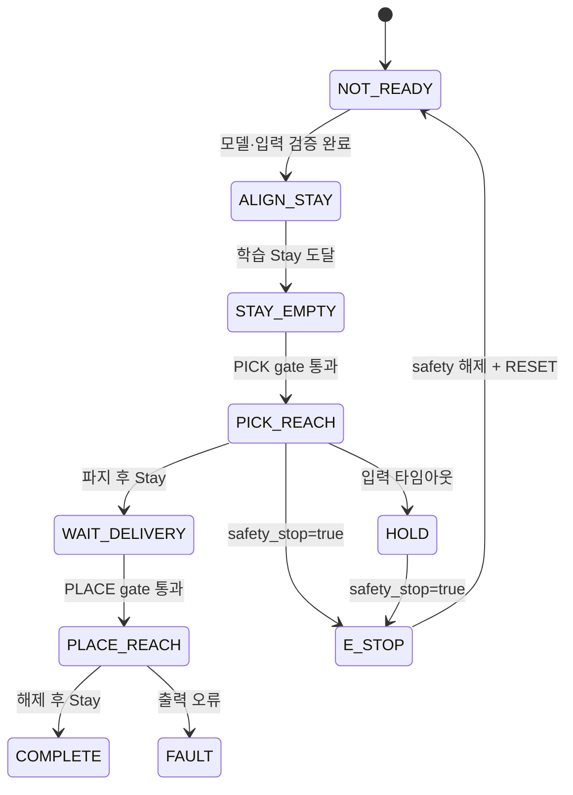

# omx_rl_control

OpenMANIPULATOR-X의 `joint1`~`joint4`를 학습된 PPO residual
정책으로 제어하는 ROS 2 패키지다. 베이스 이동과 그리퍼 개폐는 정책 밖의
결정론적 상태 머신이 담당한다.

## 현재 구현

| 영역 | 내용 |
|---|---|
| 정책 | `arm_delivery_residual_v2`, checksum 검증 후 로딩 |
| 추론 장치 | NVIDIA CUDA GPU (`policy_device: cuda`) |
| 관측 | 학습과 동일한 33차원 순서·정규화 |
| 행동 | 기준 경로 + PPO 10% residual + EMA + 관절 제한 |
| 기준 경로 | 접근 waypoint, numerical pregrasp IK, Stay 복귀 |
| 그리퍼 | `/gripper_controller/gripper_cmd` Action |
| 안전 | 입력 timeout, 추론 deadline, NaN, 관절 제한, E-Stop |
| 상태 | Stay 정렬, Pick, grasp, Place, Hold, Fault, E-Stop |

상세 계약과 단계별 검증 기준은
[`docs/OMX RL 제어 계획서.md`](../docs/OMX%20RL%20제어%20계획서.md)를 따른다.

## 제어 루프



정책 추론과 안전 판정을 분리한다. 모델이 비정상 값을 내거나 입력 데이터가 오래되면, 이전 명령을 유지하지 않고 정지 자세 또는 출력 차단으로 전환한다.

## 책임 범위

| 포함 | 제외 |
|---|---|
| 관측값 조합·정규화 | 카메라 영상 검출 |
| PPO 모델 로딩과 추론 | PPO 학습 환경 구현 |
| 정책 출력을 관절 명령으로 변환 | TurtleBot3 경로 계획 |
| 관절·속도·주기·타임아웃 제한 | 중앙 서버 임무 스케줄링 |
| 상태와 오류 코드 발행 | UWB 위치 계산 |

## 주요 인터페이스

| 구분 | 이름 | 타입 | 설명 |
|---|---|---|---|
| 입력 | `/target/object_pose` | `geometry_msgs/msg/PoseStamped` | Vision이 생성한 상자 목표 자세 |
| 입력 | `/joint_states` | `sensor_msgs/msg/JointState` | 현재 관절 위치와 속도 |
| 입력 | `/target/valid` | `std_msgs/msg/Bool` | Vision 자세 유효성 |
| 입력 | `/rl_control/command` | `std_msgs/msg/String` | `PICK`, `PLACE`, `HOLD`, `RESET`, `E_STOP` |
| 입력 | `/safety_stop` | `std_msgs/msg/Bool` | 비상 정지 |
| 출력 | `/arm_controller/joint_trajectory` | `trajectory_msgs/msg/JointTrajectory` | 제한된 관절 목표 |
| Action | `/gripper_controller/gripper_cmd` | `control_msgs/action/GripperCommand` | 그리퍼 제어 |
| 출력 | `/target/base_hold` | `std_msgs/msg/Bool` | 팔 동작 중 베이스 정지 |
| 출력 | `/rl_control/status` | `std_msgs/msg/String` | 준비·실행·정지·오류 상태 |

## 빌드

```bash
cd /home/ktj/omx_turtle_ws
source /opt/ros/humble/setup.bash
colcon build --symlink-install --packages-select omx_rl_control
source install/setup.bash
```

Stable-Baselines3와 CUDA 지원 PyTorch는 ROS Python에서 import 가능해야 한다.
현재 기본 설정은 NVIDIA GPU를 요구하며, GPU가 없는 장치에서는
`config/rl_control.yaml`의 `policy_device`를 `cpu`로 변경해야 한다.

## Fake hardware 실행

```bash
ros2 launch omx_rl_control rl_control.launch.py \
  start_hardware:=true use_fake_hardware:=true
```

노드는 joint state와 그리퍼 Action server가 준비될 때까지 `NOT_READY`를
유지하고, 학습 Stay `[0, 0, 1.38, -1.38]` 정렬 후 `STAY_EMPTY`가 된다.
실제 팔에서는 EEF 카메라 보정 전 `PICK` 명령을 보내지 않는다.

## Gazebo 실행

```bash
ros2 launch omx_rl_control rl_gazebo.launch.py
```

전용 world는 로봇 전방 `0.27 m`에 `13 x 13 x 17 cm` 타워와
`6 x 5.5 x 5.5 cm` 상자를 배치한다. Gazebo에서는 기존 `mp_control`을
시작하지 않고 RL 노드만 팔 trajectory를 소유한다.

Gazebo launch는 5.5 cm 상자용 파지 위치 `0.0045 m`, 250 ms trajectory,
0.75초 릴리스 안정화와 EEF-상자 중심 오프셋을 시뮬레이션 override로
적용한다. 정책 관측 정규화와 실기 기본값은 변경하지 않는다.

GPU server 기반 시험은 다음 환경으로 실행한다.

```bash
export __NV_PRIME_RENDER_OFFLOAD=1
export __GLX_VENDOR_LIBRARY_NAME=nvidia
ros2 launch omx_rl_control rl_gazebo.launch.py \
  start_rviz:=false \
  gz_args:="-r -s --headless-rendering --render-engine-server ogre2 \
  /home/ktj/omx_turtle_ws/src/omx_rl_control/worlds/rl_pick_place.world"
```

이 구성에서 PPO와 server-side OGRE2 Sensors는 NVIDIA GPU를 사용한다.
Gazebo ODE 물리와 ROS 2 executor는 CPU에서 실행된다.

## 모델 계약

`models/`에 가중치만 두지 않고 아래 정보를 함께 고정해야 한다.

| 항목 | 기록 내용 |
|---|---|
| 모델 식별자 | 파일명, 체크섬, 학습 완료 시각 |
| 학습 환경 | MuJoCo 버전, 로봇 모델, 제어 주기 |
| 관측값 | 필드 순서, 단위, 정규화 범위 |
| 행동값 | 관절 순서, 위치/속도 의미, 스케일 |
| 종료 조건 | 성공, 실패, 타임아웃 판정 |
| Sim2Real | 지연·노이즈·마찰·질량 랜덤화 범위 |

관측값 순서나 정규화 범위가 학습 시점과 다르면 모델 파일이 정상이어도 제어는 실패한다. 노드 시작 시 checksum·메타데이터·SB3 공간을 검사하고 계약이 맞지 않으면 추론을 시작하지 않는다.

## 안전 조건



| 조건 | 기본 동작 |
|---|---|
| 목표 자세 또는 관절 상태 타임아웃 | 새 명령 발행 중단 |
| NaN·Inf 또는 출력 차원 불일치 | `FAULT` 전환 |
| 관절 위치·속도 한계 초과 | 명령 거부 후 정지 |
| 추론 주기 지연 | 늦은 출력 폐기, 연속 3회면 `HOLD` |
| E-Stop 수신 | 현재 관절 hold, gripper goal 취소, 자동 재시작 금지 |

## 명령 예시

```bash
ros2 topic pub --once /rl_control/command std_msgs/msg/String "{data: PICK}"
ros2 topic pub --once /rl_control/command std_msgs/msg/String "{data: PLACE}"
ros2 topic echo /rl_control/status
```

colcon 테스트는 `19 passed, 1 skipped`이며, fake ros2_control에서 정상
Pick-Place 전체 사이클, 동작 중 E-Stop, Vision pose timeout, 베이스 이동
interlock을 확인했다. Gazebo에서는 최종 상자 중심
`(0.271851, 0.000003, 0.197500) m`를 확인해 타워 상판 물리 배치까지
검증했다.
