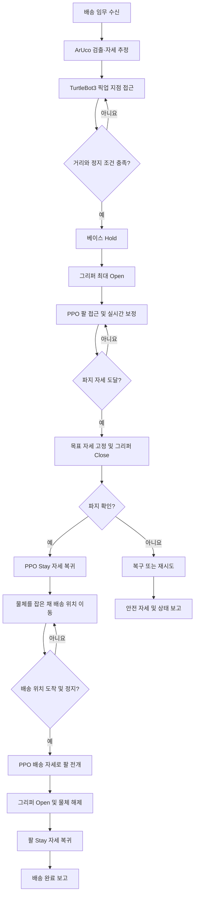
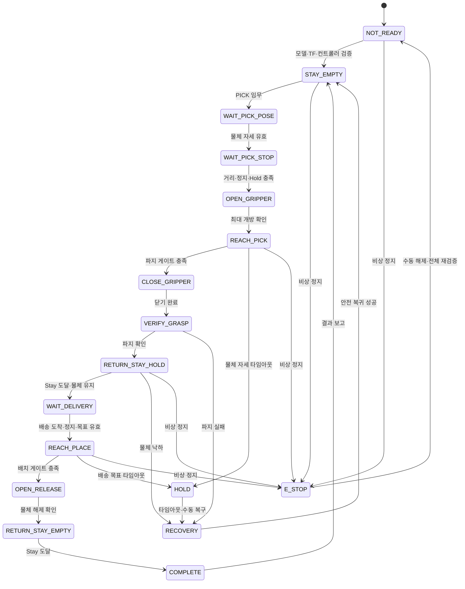
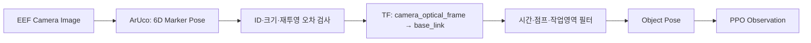

# Arm-Only RL Delivery Runtime Plan

작성 기준일: 2026-07-16

이 문서는 배송로봇의 인식, 이동, 팔 제어, 그리퍼 제어를 하나의 임무 흐름으로 연결하기 위한 런타임 기준안이다. PPO 정책은 OpenMANIPULATOR-X의 `joint1`~`joint4`만 제어한다. TurtleBot3 이동과 그리퍼 개폐는 정책 밖의 상태 머신이 담당한다.

> 이 문서의 토픽명과 초기 임계값은 구현 기준안이다. 실제 하드웨어 검증 후 값은 YAML로 옮기되, 책임 경계와 상태 전이 조건은 유지한다.

## 1. 시스템 경계

| 영역 | 담당 | 정책 학습 여부 |
|---|---|---|
| 물체 검출·자세 추정 | `omx_eef_vision`의 EEF ArUco + TF | 학습 정책 외부 |
| 픽업·배송 위치까지 이동 | TurtleBot3 주행 제어 | 학습하지 않음 |
| 팔 접근·보정·복귀 | `omx_rl_control`의 PPO 추론 | `joint1`~`joint4`만 학습 |
| 그리퍼 열기·닫기·유지 | `omx_rl_control` 상태 머신 | 결정론적 명령 |
| 임무 순서·실패 복구 | Delivery Coordinator | 학습하지 않음 |

`omx_rl_control`은 `/cmd_vel`을 발행하지 않는다. 팔 정책이 활성화되는 동안 베이스는 반드시 정지 상태로 잠겨 있어야 한다.

## 2. 전체 임무 흐름



배송 완료는 팔을 뻗은 순간이 아니라 **배송 목표 도달, 그리퍼 개방, 물체 해제, 팔의 Stay 복귀**까지 확인한 시점으로 정의한다.

## 3. 런타임 상태 머신



| 상태 | 소유 제어 | 완료 조건 |
|---|---|---|
| `WAIT_PICK_POSE` | Vision | 지정 ArUco 자세가 연속적으로 유효하고 `/target/valid=true` |
| `WAIT_PICK_STOP` | Navigation | 목표 거리 도달, 선속도·각속도 정지, 베이스 Hold 활성 |
| `OPEN_GRIPPER` | State Machine | 그리퍼 목표 `0.019 m` 도달 |
| `REACH_PICK` | PPO | EEF-물체 거리·XY·Z·방향 게이트 충족 |
| `CLOSE_GRIPPER` | State Machine | 목표를 고정하고 그리퍼를 닫기 위치로 명령 |
| `VERIFY_GRASP` | State Machine | 그리퍼 완료와 물체 추종 또는 부하 신호 확인 |
| `RETURN_STAY_HOLD` | PPO | 물체를 유지하며 팔 관절이 Stay 허용오차 안에 진입 |
| `WAIT_DELIVERY` | Navigation | 팔은 Stay 유지, 그리퍼는 파지 명령 유지 |
| `REACH_PLACE` | PPO | 배송 목표 자세와 배치 허용오차 충족 |
| `OPEN_RELEASE` | State Machine | 그리퍼 개방과 물체 분리 확인 |
| `RETURN_STAY_EMPTY` | PPO | 빈 그리퍼로 Stay 복귀 |

## 4. EEF 카메라 인식과 보정



배송 상자 식별과 자세 추정은 지정 ArUco 마커 하나로 통일한다. 마커 크기와 CameraInfo를 이용해 미터 단위 6D 자세를 계산하고, 마커에서 상자 파지점까지의 고정 변환을 적용한다.

### 보정 규칙

| 구간 | 목표 자세 처리 |
|---|---|
| 픽업 지점 접근 중 | Vision 자세를 주행 제어에 제공하되 팔 정책은 비활성 |
| `REACH_PICK` | 새로운 자세를 매 제어 주기 반영해 팔 궤적 보정 |
| 파지 게이트 진입 | 연속 유효 프레임을 확인한 뒤 최종 목표를 latch |
| `CLOSE_GRIPPER` 이후 | 손가락이 닫히는 동안 목표 변경 금지 |
| 파지 후 | 물체 자세 대신 Stay 또는 배송 목표 자세를 정책에 제공 |

마커가 잠깐 가려져도 마지막 좌표로 계속 전진하지 않는다. `REACH_PICK`에서 자세가 만료되면 팔 명령을 Hold하고, 제한 시간 안에 복구되지 않으면 안전 자세로 후퇴한다.

## 5. PPO 정책 계약

### 행동 공간

```text
action.shape = (4,)
action[0:4] = joint1, joint2, joint3, joint4 target delta
action range = [-1, 1]
```

초기 변환 기준은 기존 smooth-control 설정을 따른다.

```text
filtered = previous + 0.18 * (raw - previous)
joint_target += filtered * [0.014, 0.014, 0.014, 0.014] rad
```

결과는 MuJoCo와 실제 OpenMANIPULATOR-X의 공통 관절 한계로 clip한 뒤, 속도·가속도 제한이 적용된 짧은 `JointTrajectory`로 변환한다. PPO는 베이스 속도와 그리퍼 명령을 출력하지 않는다.

| 관절 | 정책 출력 제한 |
|---|---:|
| `joint1` | `[-2.82743, 2.82743] rad` |
| `joint2` | `[-1.79071, 1.57080] rad` |
| `joint3` | `[-0.942478, 1.38230] rad` |
| `joint4` | `[-1.79071, 2.04204] rad` |

이 값은 사용할 smooth MJCF의 범위이며 현재 ROS URDF 범위 안에 들어가는 보수적인 제한이다.

### 관측 공간

학습과 런타임은 아래 33차원 순서를 동일하게 사용한다. 정확한 순서와 정규화 값은 배포 모델의 `policy_metadata.yaml`로 검증한다.

| 범위 | 값 | 단위·표현 |
|---|---|---|
| `0:4` | 팔 관절 위치 | rad, 관절 한계 정규화 |
| `4:8` | 팔 관절 속도 | rad/s, 설정 범위 정규화 |
| `8` | 그리퍼 위치 | m |
| `9` | 그리퍼 속도 | m/s |
| `10:13` | EEF 위치 | `base_link`, m |
| `13:16` | 활성 목표 위치 | `base_link`, m |
| `16:19` | 목표-EEF 위치 오차 | m |
| `19:21` | 목표 bearing | `sin`, `cos` |
| `21:23` | 목표 yaw | `sin`, `cos` |
| `23` | 그리퍼 roll 오차 | rad |
| `24` | 물체 파지 상태 | 0 또는 1 |
| `25:29` | 정책 phase | one-hot 4차원 |
| `29:33` | 이전 팔 action | 정규화된 4차원 |

정책 phase 순서는 `PICK_REACH`, `PICK_TO_STAY`, `PLACE_REACH`, `PLACE_TO_STAY`로 고정한다.

## 6. 그리퍼와 Stay 자세

| 항목 | 기준값 | 출처 |
|---|---:|---|
| 최대 개방 | `0.019 m` | MuJoCo/실기기 설정 공통 |
| 최대 닫기 명령 | `-0.010 m` | MuJoCo/실기기 설정 공통 |
| Stay 팔 자세 | `[0.0, 0.0, 1.38, -1.38] rad` | MJCF `stay` keyframe |
| Stay 허용오차 | 관절 L2 오차 `<= 0.04 rad` | 기존 smooth-control 기준 |

파지 후 Stay 복귀에서는 팔 관절만 Stay 자세로 이동한다. 그리퍼는 Stay keyframe의 그리퍼 값으로 돌아가지 않고, 물체를 잡았을 때의 닫기·유지 명령을 계속 사용한다.

실기기 파지 성공은 다음 신호를 조합한다.

1. `GripperCommand`가 오류 없이 종료됨.
2. 그리퍼 위치 또는 모터 부하가 물체 접촉 상태와 일치함.
3. 짧은 lift 동작에서 물체 자세가 EEF와 함께 이동함.

사용 가능한 전류·부하 피드백이 없다면 3번을 필수 확인으로 둔다. 단순히 닫기 Action이 끝난 것만으로 파지 성공을 선언하지 않는다.

## 7. ROS 2 인터페이스 기준안

| 방향 | 인터페이스 | 타입 | 목적 |
|---|---|---|---|
| 입력 | `/target/object_pose` | `geometry_msgs/msg/PoseStamped` | `base_link` 기준 픽업 물체 자세 |
| 입력 | `/target/valid` | `std_msgs/msg/Bool` | Vision 자세 유효성 |
| 입력 | `/target/delivery_pose` | `geometry_msgs/msg/PoseStamped` | 배송 배치 목표 자세 |
| 입력 | `/joint_states` | `sensor_msgs/msg/JointState` | 팔·그리퍼 상태 |
| 입력 | `/leader/nav_feedback` | `std_msgs/msg/String` | 픽업·배송 위치 도착 상태 |
| 입력 | `/target/base_hold` | `std_msgs/msg/Bool` | 베이스 정지 잠금 확인 |
| 입력 | `/safety_stop` | `std_msgs/msg/Bool` | 비상 정지 |
| 명령 | `/arm_controller/joint_trajectory` | `trajectory_msgs/msg/JointTrajectory` | 제한된 팔 관절 목표 |
| Action | `/gripper_controller/gripper_cmd` | `control_msgs/action/GripperCommand` | 결정론적 개방·파지·해제 |
| 호환 입력 | `/mp_control/start` | `std_msgs/msg/Empty` | 기존 coordinator의 픽업 시작 신호 |
| 출력 | `/mp_control/status` | `std_msgs/msg/String` | 기존 coordinator 호환 상태 |
| 출력 | `/rl_control/status` | `std_msgs/msg/String` | 세부 상태·오류 코드 |

배송 목표는 첫 버전에서 정지한 로봇 기준의 보정된 고정 자세를 사용한다. 배송 지점에 ArUco가 설치되면 같은 `/target/delivery_pose` 계약으로 Vision 기반 자세를 대체할 수 있다.

## 8. 시작 임계값

| 파라미터 | 초기값 | 비고 |
|---|---:|---|
| 픽업 정지 거리 | `0.22 m` | 기존 통합 시험 거리, 실측 재보정 필요 |
| 거리 허용오차 | `±0.02 m` | 주행 정지 판정 |
| 정지 선속도 | `< 0.01 m/s` | 0.5초 연속 만족 |
| 정지 각속도 | `< 0.05 rad/s` | 0.5초 연속 만족 |
| Vision pose timeout | `0.5 s` | 기존 ArUco bridge 기준 |
| 안정 자세 프레임 | `5 frames` | 파지 목표 latch 전 확인 |
| 파지 거리 | `<= 0.040 m` | 기존 smooth-control 기준 |
| 파지 XY 거리 | `<= 0.030 m` | 기존 smooth-control 기준 |
| 파지 Z 오차 | `<= 0.030 m` | 기존 smooth-control 기준 |
| bearing 오차 | `<= 0.35 rad` | 기존 smooth-control 기준 |
| 정책 주기 | `50 Hz` | MuJoCo `0.02 s` 환경 step과 일치 |

이 값은 출발점이다. 카메라 보정 오차와 실제 상자 크기를 측정한 뒤 파지·배송 평가표에 근거해 조정한다.

## 9. 안전·복구 원칙

| 감지 조건 | 즉시 동작 | 다음 상태 |
|---|---|---|
| 베이스 Hold 해제 또는 속도 발생 | 팔 action 0, 현재 관절 목표 유지 | `HOLD` |
| 물체 자세 타임아웃 | 목표 갱신 중단, 전진 금지 | `HOLD` |
| 자세 급변·작업영역 이탈 | 해당 측정 폐기 | `HOLD` 또는 `RECOVERY` |
| 관절 한계·NaN·추론 오류 | 새 궤적 발행 중단 | `FAULT` |
| 파지 후 물체 낙하 | 팔을 급히 접지 않고 정지 | `RECOVERY` |
| 통신 단절 | 팔·베이스 출력 차단 | `FAULT` |
| E-Stop | 모든 명령 즉시 차단 | `E_STOP` |

E-Stop과 `FAULT`는 자동 재시작하지 않는다. 수동 해제 후 모델, TF, Vision, 컨트롤러, Stay 자세를 다시 검증한다.

## 10. 구현 모듈

```text
omx_rl_control/
├── docs/arm_delivery_runtime_plan.md
├── config/rl_control.yaml
├── launch/rl_control.launch.py
├── models/<policy_version>/
│   ├── policy.zip
│   ├── policy_metadata.yaml
│   ├── evaluation.yaml
│   └── SHA256SUMS
└── omx_rl_control/
    ├── rl_control_node.py       # 상태 머신·PPO 추론
    ├── observation_builder.py   # 33차원 관측 계약
    ├── action_limiter.py        # 관절·속도·가속도 제한
    ├── gripper_manager.py       # Open/Close/Hold/Release
    └── model_contract.py        # 모델 메타데이터 검증
```

## 11. 통합 완료 기준

| 시험 | 완료 기준 |
|---|---|
| Vision 정지 시험 | 동일 물체에서 자세가 만료·급변 없이 안정적으로 유지 |
| 팔 접근 시험 | 베이스 정지 상태에서만 PPO가 활성화되고 목표 변화에 보정 |
| 파지 시험 | 그리퍼 최대 개방 후 파지, lift, Stay 복귀 동안 물체 유지 |
| 이동 시험 | 배송 주행 중 팔 Stay와 그리퍼 파지 명령 유지 |
| 배치 시험 | 배송 자세 도달 후 해제하고 Stay 복귀 |
| 실패 시험 | 카메라 단절, 베이스 움직임, 추론 오류, E-Stop에서 안전 정지 |
| 반복 시험 | 픽업·배송 전체 성공률 `>= 90%`, 충돌 및 낙하 `0회` 목표 |

## 12. 구현 순서

1. Vision의 `camera_optical_frame -> base_link` TF와 자세 품질을 먼저 검증한다.
2. PPO 없이 Stay, 최대 개방, 닫기, 유지, 해제 명령을 실기기에서 검증한다.
3. 학습 저장소에서 4차원 arm-only 정책을 학습하고 artifact 계약을 고정한다.
4. `omx_rl_control`에서 모델 로딩과 33차원 관측 검증을 구현한다.
5. Fake hardware에서 상태 머신과 오류 전이를 검증한다.
6. 저속 실기기에서 `REACH_PICK -> RETURN_STAY_HOLD`만 먼저 시험한다.
7. 배송 위치 도착 이후 `REACH_PLACE -> RETURN_STAY_EMPTY`를 별도로 시험한다.
8. 마지막에 TurtleBot3 이동을 사이에 연결해 전체 임무를 반복 평가한다.
